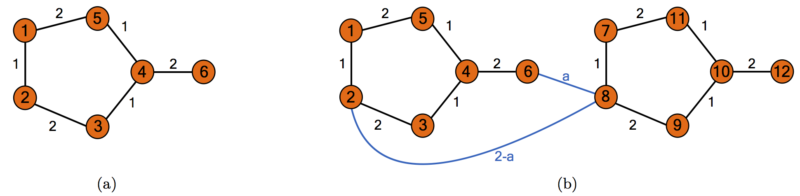

## Instructions:

* This portion of the exam should be added to the back of the written part and the essay, and you should submit a single, stapled copy.
* You must also submit this file in Moodle.
* Please fill in your name in the appropriate place below.
* Please leave intact the leading blocks which load the Matrix package and set the number of digits for display of numbers.
* Please read carefully the instructions for each problem. 
* Please preserve all of the section headings for solutions, and insert your solutions in the appropriate places.
* You are certainly allowed to pull code from things we've used/developed in this course (e.g., any code I gave you as part of in-class activities).


```{r global_options, include=FALSE}
knitr::opts_chunk$set(options(digits=8))
```

```{r,message=FALSE}
require(Matrix)
```

### Problem 7

In this problem, we are going to use sparse matrices to represent chemical graphs of organic molecules, and then use eigenvalues to analyze where two molecules might bridge (connect). 

***



***

Figure 1(a) shows the voltage graph for a single fulvene molecule. The graphs for two individual molecules can be bridged by adding one or more edges  connecting a vertex from each graph. As an example, in Figure 1(b), we consider adding two new edges (shown in blue), each connecting vertices from each of the initial graphs. The resulting weighted, undirected graph in Figure 1(b) features 12 vertices, labeled 1 through 12. The edges of the graph connecting vertices on the same organic molecule retain their initial edge weights. The two new connecting edges have weights of $a$ (connecting vertices 6 and 8) and $2-a$ (connecting vertices 2 and 8), where $a$ is some number between 0 and 2. The weighted adjacency matrix $W$ for this bridged graph is a $12 \times 12$ matrix, with the $(i,j)^{th}$ entry $W_{ij}$ equal to 0 if there is no edge connecting vertices $i$ and $j$, and equal to the weight of the edge connecting vertices $i$ and $j$ otherwise.

### Part (A): 2 points
Let $a=1$. Create the sparse matrix $W$. Run the command `image(W)` to make sure your $W$ has the correct sparsity (nonzero) pattern. 

### Part (A) solution

```{r}
# Your code here
# UNCOMMENT NEXT LINE ONCE YOU CALCULATE W
W <- spMatrix(nrow =12, ncol=12, 
              i=c(2:5,8:11,1:4,7:10,5,1,6,4,7,11,10,12),
              j=c(1:4,7:10,2:5,8:11,1,5,4,6,11,7,12,10),
              x=c(c(1,2,1,1),c(1,2,1,1),c(1,2,1,1),c(1,2,1,1),2,2,2,2,2,2,2,2))
a = 1
W[8,2] <- 2-a 
W[2,8] <- 2-a
W[8,6] <- a
W[6,8] <- a 

image(W)
```

### Part (B): 1 point

The graph Laplacian matrix is defined as $L=D-W$, where $W$ is the weighted adjacency matrix, and $D$ is a diagonal matrix, with the $i^{th}$ diagonal element equal to the degree of vertex $i$; that is, the sum of the weights of the edges leading into vertex $i$. You can compute $D$ with the command \texttt{D=diag(rowSums(W))}. Still using $a=\frac{1}{2}$, form the matrix $L$ and print out its eigenvalues. There should be one zero eigenvalue and the rest should be positive. For an undirected graph, the number of graph Laplacian eigenvalues equal to zero is equal to the number of connected components in the graph.

### Part (B) solution

```{r}
# Your code here
W <- spMatrix(nrow =12, ncol=12, 
              i=c(2:5,8:11,1:4,7:10,5,1,6,4,7,11,10,12),
              j=c(1:4,7:10,2:5,8:11,1,5,4,6,11,7,12,10),
              x=c(c(1,2,1,1),c(1,2,1,1),c(1,2,1,1),c(1,2,1,1),2,2,2,2,2,2,2,2))
a = .5
W[8,2] <- 2-a 
W[2,8] <- 2-a
W[8,6] <- a
W[6,8] <- a 
D=diag(rowSums(W))
L = D-W
eigen(L)$values
```

### Part (C): 6 points

The weighted adjacency matrix $W$ has both negative and positive eigenvalues. The spectral gap of $W$ is the difference between the negative eigenvalue closest to 0 and the positive eigenvalue closest to 0. For example, when $a=1$, the negative eigenvalue closest to 0 is -0.755, and the positive eigenvalue closest to 0 is 1.344. So the spectral gap is 2.099.

We are going to let $a$ vary, and see how it affects the spectral gap. Create a function \texttt{sg(a)} that takes  as input a choice of $a$ between 0 and 2, and returns the spectral gap of the graph shown above in Figure 1(b), for the given value of $a$. Plot the function \texttt{sg($\cdot)$} on the interval $[0,2]$.

### Part (C) solution

```{r}
# Your code here
sg = function(a) {
  W[8,2] = 2-a
  W[2,8] = 2-a
  W[8,6] = a
  W[6,8] = a
  eigenValue = eigen(W)$values

  negEigen=min(eigenValue) 
  posEigen=max(eigenValue)
  for (i in eigenValue) {
    if (i<0 & i>negEigen) {
      negEigen=i 
    }
    if (i>0 & i<posEigen) { 
      posEigen=i
    } 
  }
  return(posEigen-negEigen) 
}

sg(1)

# Your plot command here
gapList = function(rangeA) { 
  gapList=list()
  for (a in rangeA){
  gapList[length(gapList)+1]=sg(a) }
  return(gapList)
}

plot.function(gapList,0,2)
```

### Part (D): 6 points

Now we want to determine for which value of $a$ the spectral gap of the graph shown in Figure 1(b) is maximized. First, use the finite difference derivative function $D$ from Technical Report 1 (you can use yours or mine, which is called `FDDeriv`) to generate a function $g$ that is the numerical derivative of the `sg` function. Plot the function $g(\cdot)$ on the interval $[0,2]$. Then use your favorite root-finding method to find the value of $a$ on the interval $[0,2]$ that maximizes the spectral gap of $W$. For your answer to this question, include a single code block with all of your code. On the last line, execute the command `paste("Root =",as.character(root))` where root is a variable containing your approximation of the root.


### Part (D) Solution

```{r}
# Your code here
FDDeriv = function(f,delta=.000001) { 
  function(x){(f(x+delta) - f(x-delta))/(2*delta)}
}
g = FDDeriv(sg)

gList = function(rangeA) {
  gList=list()
  for (a in rangeA){
    gList[length(gList)+1]=g(a) 
  }
    return(gList) 
}
plot.function(gList,0,2)

secant = function(f, a, b, tol = 1e-05, maxiters = 12) { 
  history = rep(NA, maxiters)
  history[1] = a
  history[2] = b
  for (k in 3:maxiters) {
    x1 = history[k-2]
    x2 = history[k-1]
    newx = x2 - (f(x2)*(x2-x1))/(f(x2)-f(x1)) 
    history[k] = newx
    change = newx - history[k-1]
    if (abs(change) < tol * max(abs(history[k - 1]), tol)) 
      break 
    }
  return(list(root = newx, history = history[!is.na(history)])) 
}
root=secant(g,0,2)$root

# UNCOMMENT NEXT LINE ONCE YOU CALCULATE THE ROOT
paste("Root =",as.character(root)) 
```

### Problem 8: 15 points

Brownian motion is a simple continuous stochastic process that is widely used in physics and finance for modeling random behavior that evolves over time. Quantitative Finance uses a version called "Geometric Brownian Motion" (GBM) to predict pricing options. The general model we use to determine the future behavior of an asset is: $S_t = S_0 + e^{(\mu - \frac{\sigma ^2}{2}) t + \sigma W_t}$, where $S_t$ is the price at time t, $S_0$ is the initial price, $\mu$ is the expected return, and $\sigma$ is the standard deviation of the return.

The R implementation of the solution is shown below (no changes need to be made to this code, but look it over carefully to see what it does.):

```{r}
GBM <- function(N, sigma, mu, S0, Wt = NULL) {
  # Creates a single asset path of daily prices using Geometric Brownian Motion. 
  # One year is 252 days since that is about how many trading days are in any
  # given year.
  #
  # Inputs:
  #   N: Number of days in the path.
  #   sigma: Standard deviation of daily continuously compounded 
  #          returns (known as volatility).
  #   mu: Average daily continuously compounded returns (known as drift). 
  #   S0: The initial price of the asset. 
  #   Wt: The cumulative Brownian motion of the model. This can be supplied or 
  #       left as NULL. In the case that it is NULL, a vector will be provided.
  #       If you include this argument, it must be a vector of length N of the 
  #       cumulative sum of a random variable to work properly. (Steps i.-iii. below    
  #       create this.) 
  #
  # Returns:
  #   A vector of length N containing the asset prices generated by the specified
  #   GBM. 
  if (is.null(Wt)) {
    Wt <- cumsum(rnorm(N, 0, 1))
  }
  t <- (1:N)/252
  p1 <- (mu - 0.5*(sigma*sigma)) * t
  p2 <- sigma * Wt
  St = S0 * exp(p1 + p2)
  return(St)
}
```

### Part (A): 6 points

We are going to simulate the prices of several correlated assets over time, using Correlated GBM. Imagine we have assets that are dependent on each other. Our goal is to predict future asset values taking into consideration correlation of past asset values. The simulation process starts with an $n \times n$ correlation matrix $C$, which shows the correlation between $n$ stocks. The following is the procedure for generating correlated random variables:

i. Perform Cholesky Decomposition of correlation matrix $C$ to obtain upper triangular matrix $R$.
ii. Generate a random matrix $X$ with $n$ columns following a standard normal distribution with mean = 0 and variance = 1.
iii. Obtain a correlated random matrix $W_t = XR$. This generates a matrix that encodes both randomness and correlation within the problem.
iv. Use the above `GBM` function to generate the daily price path for each asset.

Implement the algorithm described above. Below is a starter of the function:

### Part (A) Solution

```{r}
CorrelatedGBM <- function(N, S0, mu, sigma, cor.mat) {
  # Creates a matrix of correlated daily price paths using Geometric 
  # Brownian Motion. 
  #
  # Inputs: 
  #   N: Number of days in the path.
  #   mu: A vector of drift or average daily continuously compounded returns.  
  #   sigma: A vector of volatility or standard deviation of daily continuously compounded returns. 
  #   S0: A vector of initial prices of the assets. 
  #   cor.mat: The correlation matrix of the daily continuously compounded 
  #            returns. 
  #
  # Returns:
  #   A matrix of simulated daily price paths of length N having the same number
  #   of assets as in the mu and sigma vectors. Note that mu and sigma must have
  #   the same dimensions. 
  
  GBMs <- matrix(nrow = N, ncol = length(mu)) # Generate empty GBM vector for return
  
  # Fill in code below for Step i.
	R = chol(cor.mat)
  # Step ii. (done for you):
  X <- matrix(rnorm(N * length(mu), 0, 1), ncol = length(mu)) 
  X <- apply(X, 2, cumsum) 
  
  # Fill in code below for Step iii.
  Wt = X %*% R
  # Fill in code below for Step iv. and store it in GBMs:
  GBMs = GBM(N,sigma,mu, S0, Wt)
  return(GBMs)
}
```


### Part (B): 6 points

Delta, United, and American Airlines are the three biggest airlines in the U.S. airlines market. The dataset `AirlineStockPrices.csv` records the stock price for these three stocks starting from July 1, 2007. In order to simulate the stock prices, we need to determine the inputs for the function `CorrelatedGBM`. Here are the steps you can follow to generate every piece of information you'll need:

i. Generate a return matrix by calculating the daily log return. For example, $r_{i,j} = log(\frac{S_{i+1,j}}{S_i,j})$ where $r_{i,j}$ denotes the return while $S_{i,j}$ denotes the price for stock $j$ in the $i^{th}$ day.
ii. Use the `cor()` function to calculate the correlation matrix $cor.mat$ on the return matrix.
iii. Calculate the column mean of the return matrix to create the vector of average returns $mu$. 
iv. Calculate the standard deviation of each column of the return matrix to create the vector of standard deviations $sigma$. (HINT: `sd()` is a function that computes standard deviation. You may find the function `apply()` useful, but it is not required to use it).
v. Generate the vector that represents the current price value $S_0$ (that is, the last price available).

### Problem (B) solution

```{r message=FALSE, warning=FALSE}
# Your code here
library(readr)
AirlineStockPrices <- read_csv("AirlineStockPrices.csv", col_names = FALSE, skip = 1)

S <- as.matrix(AirlineStockPrices)
R = matrix(0,nrow = nrow(S)-1, ncol = ncol(S))
for (j in 1:ncol(S)){
for (i in 1:(nrow(S)-1)){
R[i,j]=log(S[i+1,j]/S[i,j]) }
}

cor.mat=cor(R)

mu=colMeans(R)

sigma =c(sd(R[,1]),sd(R[,2]),sd(R[,3]))

S0=c(S[nrow(S),])
```

### Problem (C): 1 point

We would like to simulate the price of these stocks over 3 years (remember there are only 252 trading days in a year). Use the `CorrelatedGBM` function to construct the three paths of these stock prices. Plot the path of these stocks over 3 years using the code below:

### Problem (C) solution
```{r}
N=252*3
##UNCOMMENT CODE BELOW ONCE ALL VARIABLES FROM PREVIOUS PROBLEM ARE DEFINED 

# make correlated asset paths
set.seed(123) # include this so everyone has the same random initialization
paths <- CorrelatedGBM(N, S0 , mu, sigma, cor.mat)
 
# make a basic r plot 
colors <- c('darkblue', 'darkgreen', 'darkgoldenrod')
t <- (1:N)/252
plot(t, paths[,1], type = 'l', ylim = c(0, max(paths)), xlab = "Year", 
    ylab = "Price", main = "Simulated Asset Prices", col = colors[1])
 
for (i in 2:ncol(paths)) {
 lines(t, paths[, i], col = colors[i])
}
legend(x = 0.5, y = 145,c('DAL','UAL','AAL'), lty = c(1,1,1), col = colors, cex = 0.7)
```

### Problem (D): 2 points

What do you observe about the stock prices? How will you invest based on the simulation?

### Problem (D) Solution

*Three stock prices remain low in the first year(0 to 1 year), and they increased after the first year, reached the highest at the midlle of 2 and 2.5 year in the figure. Then stocks overall decreased and rebounded at the end of the third year. The stock price of AAL fluctates the most, whereas DAL flucteates the least. Therefore, I would invest the AAL for its high potential, but I will invest UAL first for the beginning of the fourth year since the trend in the figure indicates that the UAL is experiencing an siginificant increase.*


