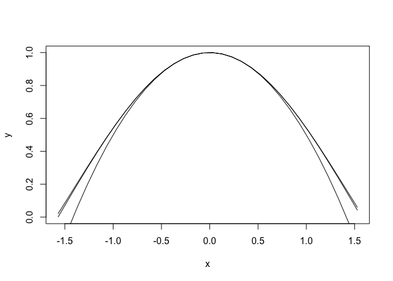
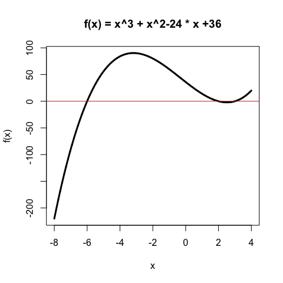

# Math 365 / Comp 365: Homework 1

### Please submit a *stapled* hard copy of your work

Reminder: you are allowed---in fact encouraged---to work on and discuss homework together. You should, however, write up your own assignments in your own words. If you work with another person or if you get significant help from a classmate or external resource, you should give that person or resource credit in your solution (at no penalty to you)

## Charles Zhang

### Problem 1
Implement a general version of Horner's method. It should be of the form `Horner(coeffs,x)` and it should return the value of the polynomial whose coefficients are given by the vector `coeffs`, evaluated at the scalar (or vector of scalars) $x$. Make sure to include comments describing what your function is doing. Test your function by solving $f(x)=2x^5-8x^3+3x^2+7$ at $x=3$ and then at $x=3,6,9,12$.


```r
Horner <- function(coeffs,x) {
  # create the result vector and set the initial value
  res<-rep(coeffs[1],length(x))
  # based on the Horner method, repeate the procedure to time vector x and add the next coefficient
  for(i in 1:(length(coeffs)-1)) {res <- res*x + coeffs[i+1]}
  return(res)
}

coeffs<-c(2,-8,3,7)
x<-c(3,6,9,12)
Horner(coeffs,x)
```

```
## [1]   -2  169  844 2347
```
  while (i < length(coeffs)) {
    # based on the Horner method, repeate the procedure to time vector x and add the next coefficient
    res <- res*x + coeffs[i+1]
    i<-i+1
### Problem 2
The point of this problem is twofold: (i) to illustrate what can happen if you accumulate many truncations of numbers and (ii) to give you practice writing programs.

In the 1999 movie Office Space, a character creates a program that takes fractions of cents that are truncated in a bank's transactions and deposits them into his own account. This is not a new idea, and hackers who have actually attempted it have been arrested. In this exercise, you will simulate the program to determine how long it would take to become a millionaire this way. 

Assume the following details:

* You have access to 10,000 bank accounts

* Initially, the bank accounts have values that are uniformly distributed between $100 and $100,000

* The nominal annual interest rate on the accounts is 5%

* The daily interest rate is thus .05/365

* Interest is compounded each day and added to the accounts, except that fractions of a cent are truncated 

* The truncated fractions are deposited into an illegal account that initially has a balance of $0

* The illegal account can hold fractional values and it also accrues daily interest

Your job is to write an R script that simulates this situation and finds how long it takes for the illegal account to reach a million dollars.


-------------------

Here is some R help:

The following code generates the initial accounts:

```r
options(digits=10)
accounts=runif(10000,100,100000)
accounts = floor(accounts*100)/100
```
The first line expands the number of digits displayed. The second sets up 10,000 accounts with values uniformly between 100 and 100,000. The third line removes the fractions of cents (look at the data before and after that line is applied). To calculate interest for one day:

```r
interest = accounts*(.05/365)
```
Depending on how you do it, you might want to use an if-then statement. For example, you might use something like

```
if (illegal > 1000000) break
```

The `break` command breaks out of a loop. Or, perhaps more elegantly, you might use a `while` loop

```
while (illegal < 1000000) { do stuff here }
```

You can find help on syntax in the Help Menu under "The R Language Definition." That's where I went to remind myself about the syntax for an if-then statement and a while loop.

```r
day <- 0
illegal <- 0
while (illegal < 1000000) {
  day <- day+1  # accumulative days
  interest = accounts*(.05/365) # interest per day
  dep <- floor(interest*100)/100  # interest that can be deposited 
  illegal <- illegal + sum(interest-dep)  # add up the difference between the deserved interest and the actually deposited interest to the illegal account
  accounts <- accounts+dep  # add the interest that can be deposited to the account for next day
}
print(day)
```

```
## [1] 19993
```

```r
print(day/365)
```

```
## [1] 54.77534247
```

> After several runnings for this simulation, the approximate average time to accumulate a million dollars is around 20000 days or in 55 years.

### Problem 3
We'll be using polynomial approximation techniques regularly in the class, and it may have been a while since you learned Taylor's Theorem, so here is a chance to review it quickly in Section 0.5:

Problem 8 in Section 0.5 in the book (Taylor polynomial approximation of cosine).

(a) Find the degree 5 Taylor polynomial P(x) centered at x = 0 for f(x) = cosx. 

> $f(x)=cosx$<br>
$f(0)=1$<br>
$f'(0)=0$<br>
$f''(0)=-1$<br>
$f'''(0)=0$<br>
$f''''(0)=1$<br>
$f'''''(0)=0$<br>
$P(x) = f(0)+f'(0)x+\frac{f''(0)}{2!}x^2+\frac{f'''(0)}{3!}x^3+\frac{f''''(0)}{4!}x^4+\frac{f'''''(0)}{5!}x^5 =1-\frac{1}{2}x^2+\frac{1}{24}x^4$<br>


(b) Find an upper bound for the error in approximating f(x) = cosx for x in [−π/4,π/4] by P(x).

> The error in the approximation $R_5(x)=\frac{max(cos(a))}{(5+1)!}x^{(5+1)}=\frac{1}{720}x^6$, 
since x in [−π/4,π/4] by P(x) and max(cos(a))=1. Let x = π/4, then the upper bound for the error is 0.0003259918869.


```r
(1/720)*(pi/4)^6
```

```
## [1] 0.0003259918869
```
Additional part (c) Using R, make a single plot with 3 different curves: cos(x) and the 2nd and 4th degree Tayolor approximations of cosine around x=0. Plot these on the interval $[-\pi/2,\pi/2]$.

> 2nd degree:$1-\frac{1}{2}x^2$<br>4th degree:$1-\frac{1}{2}x^2+\frac{1}{24}x^4$<br>


```r
x=seq(-pi/2,pi/2,0.1)
y=cos(x)
plot(x,y,type="l")
y2=1-1/2*x^2
lines(x,y2)
y3=1-1/2*x^2+(1/24)*x^4
lines(x,y3)
```

<!-- -->

### Problem 4

Problem 4 in the Section 0.2 Exercises, parts (a), (b), and (f) only (on converting to binary). Do all computations by hand.

(a) 11.25 

> for integer: $11/2=5...1, 5/2=2...1, 2/2=1...0, 1/2=0...1$; So $(11)_{10}$ = $(1011)_{2}$<br>
for fraction: $.25\times2=.5+0; .5\times2=0+1; 0\times0=0+0....$ So $(0.25)_{10}=(.010)_{2}$<br>Therefore, $(11.25)_{10}=(1011.010)_{2}$

(b) 2/3  

> for integer: 0<br>for fration: $2/3\times2 = 1/3+1, 1/3\times2 = 2/3+0, 2/3\times2=1/3+1... => (0.\overline{10})_{2}$ <br>So $(11)_{10}$ = $(1011)_{2}$ $(2/3)_{10}=(0.\overline{10})_{2}$


(f) 99.9

> for integer, $99/2=49...1, 49/2=24...1, 24/2=12...0, 12/2=6...0, 6/2=3...0, 3/2=1...1, 1/2=0...1$, so $(99)_{10}$ = $(1100011)_{2}$<br>
for fraction, $0.9\times2=.8+1, .8\times2=.6+1, .6\times2=.2+1, .2\times2=.4+0, .4\times2=.8+0, .8\times2=.6+1......$, so $(0.9)_{10}$ = $(0.1\overline{1100})_{2}$<br>
Therefore, $(99.9)_{10} = (1100011.1\overline{1100})_{2}$


### Problem 5
Section 0.3: Exercise 9. In this problem, you should do the following: write 7/3, 4/3, and 1/3 in binary and in their IEEE machine expressions. Then perform the required subtractions using machine arithmetic. Finally, use the command `options(digits=20)` before doing the computations in R. Recall that the command `.Machine$double.eps` will give you machine epsilon in R.

(a) Explain why you can determine machine epsilon on a computer using IEEE double precision and the IEEE Rounding to Nearest Rule by calculating (7/3 − 4/3) − 1. 


```r
(7/3-4/3)-1
```

```
## [1] 2.220446049e-16
```

```r
options(digits=20)
.Machine$double.eps
```

```
## [1] 2.2204460492503130808e-16
```

> $(7/3)_{10} = (10.\overline{01})_{2} = 1.0010101010101010101010101010101010101010101010101010 \times 2^{1}$<br> after rounding, $= 1.0010101010101010101010101010101010101010101010101011\times2^{1}$<br>
$(4/3)_{10} = (1.\overline{01})_{2}=1.0101010101010101010101010101010101010101010101010101\times2^{0} =$<br> $0.1010101010101010101010101010101010101010101010101010\times2^{1}$<br><br>
$1.0010101010101010101010101010101010101010101010101011\times2^{1} -$<br>
$0.1010101010101010101010101010101010101010101010101010\times2^{1} =$<br>
$0.1000000000000000000000000000000000000000000000000001\times2^{1}$ (after rounding) $= 1+\epsilon_{mach}$<br><br>
Therefore, $(7/3-4/3)-1=\epsilon_{mach}$, I can determine machine epsilon on a computer using IEEE double precision and the IEEE Rounding to Nearest Rule by calculating (7/3 − 4/3) − 1. 

(b) Does (4/3 − 1/3) − 1 also give mach? Explain by converting to floating point numbers and
carrying out the machine arithmetic.


```r
(4/3-1/3)-1
```

```
## [1] 0
```

> $(4/3)_{10} = (1.\overline{01})_{2}=1.0101010101010101010101010101010101010101010101010101\times2^{0}$<br>
$(1/3)_{10} = (0.\overline{10})_{2}=0.1010101010101010101010101010101010101010101010101010\times2^{0} =$<br>
$0.1010101010101010101010101010101010101010101010101011\times2^{0}$ after rounding <br>
$(4/3)_{10}-(1/3)_{10}=$<br>
$1.0101010101010101010101010101010101010101010101010101\times2^{0} -$<br>
$0.1010101010101010101010101010101010101010101010101011\times2^{0} =$<br>
$1.0000000000000000000000000000000000000000000000000000\times2^{0} = 1 \times2^{0}$<br>
Therefore, (4/3 − 1/3) − 1 = 0, which can't determine machine epsilon by calculating (4/3 − 1/3) − 1.


### Problem 6
Using R, compute:  1000000000000000000 + 100 - 1000000000000000000.
What happens?  Explain why this is. 


```r
  1000000000000000000 + 100 - 1000000000000000000
```

```
## [1] 128
```

> In IEEE double precision, $1000000000000000000 = 1.1011110000010110110101100111010011101100100000000000(52bits)\times2^{59}$<br>
$100 = 1.1001000...(52bits)\times2^{6} = 0.00..0011001\times2^{59}$(57 bits in total(52 0 before 11001))<br>
Then, 1000000000000000000 + 100 = 1.1011110000010110110101100111010011101100100000000000|11001$\times2^{59}$ = 1.1011110000010110110101100111010011101100100000000001$\times2^{59}$ after rounding.<br>
To calculate the substraction part, the computer will calculate:<br>
$1.1011110000010110110101100111010011101100100000000001\times2^{59} -$<br>
$1.1011110000010110110101100111010011101100100000000000\times2^{59}$<br>
$= 0.00...001\times2^{59}$&nbsp;&nbsp;&nbsp;&nbsp;&nbsp;&nbsp;&nbsp;&nbsp;&nbsp;&nbsp;&nbsp;&nbsp;&nbsp;&nbsp;&nbsp;&nbsp;&nbsp;&nbsp;(52 bits in fraction)<br>
$=2^{59-52}=2^{7}=128$<br>
Since the computer will systematically round after the 52 bit, the computer wll have the rounding error while caculating 1000000000000000000 + 100 - 1000000000000000000, showing above. 

### Problem 7
Find the smallest positive integer $i$ such that $i$ is not exactly representable using the IEEE standard in double precision; i.e., $\hbox{fl}(i)\neq i$.

> The IEEE standard floating expression for the largest number that can be stored is<br> $0 || 11111111110 || 111...111$ &nbsp;&nbsp;&nbsp;&nbsp;&nbsp;&nbsp;&nbsp;&nbsp;&nbsp;&nbsp;&nbsp;&nbsp;&nbsp;&nbsp;&nbsp;&nbsp;&nbsp;&nbsp;&nbsp;&nbsp;&nbsp;&nbsp;&nbsp;&nbsp;&nbsp;&nbsp;&nbsp;&nbsp;&nbsp;&nbsp;&nbsp;&nbsp;&nbsp;(1+11+52 bits)<br> Then the largest number that can be stored <br>$= 1.11...11\times2^{2046-1023} = 1.11...11\times2^{1023}$ &nbsp;&nbsp;&nbsp;&nbsp;(52 bits in the fraction) 
<br>$= 111...111\times2^{1023-52} = 11..11\times2^{971}$<br>
$=(2^{53}-1)\times2^{971}$ &nbsp;&nbsp;&nbsp;&nbsp;&nbsp;&nbsp;&nbsp;&nbsp;&nbsp;&nbsp;&nbsp;&nbsp;&nbsp;&nbsp;&nbsp;&nbsp;&nbsp;&nbsp;&nbsp;&nbsp;&nbsp;&nbsp;&nbsp;&nbsp;&nbsp;&nbsp;&nbsp;&nbsp;&nbsp;&nbsp;&nbsp;&nbsp;&nbsp;&nbsp;&nbsp;&nbsp;&nbsp;&nbsp;&nbsp;&nbsp;&nbsp;&nbsp;&nbsp;&nbsp;&nbsp;&nbsp;&nbsp;(52+1=53 '1' in total)<br>
$= 2^{1024}-2^{971}$<br> Therefore, the smallest positive integer $i$ such that $i$ is not exactly representable using the IEEE standard in double precision is $2^{1024}-2^{971}+1$

### Problem 8: 
Consider a vector $\vec{x}$ with very large entries:

```r
x <- 1e200 * (0:79 %% 2 - 0.5) * (pi**((1:80 - 40) / 10))
```
Trying to find the Euclidean length, recall $\|\vec{x}\|=\sqrt{x_1^2+x_2^2\ldots+x_n^2}$, of this vector in the usual way gives a strange result:

```r
(L <- sqrt(sum(x^2)))
```

```
## [1] Inf
```
In fact, the correct value of $L\approx 10^{202}$ is well within the range of representable numbers in the double-precision floating-point system, but the bad method above calcuates $L^2\approx 10^{404}$ as an intermediate step. This number is too big! Write a function called **my.safe.length** which can correctly compute the length of a vector with very large, but representable entries. As a hint, note that $\|(-500,1000)\| = 1000 \|(-0.5,1)\|$; on the right-hand side we never take the square of a number greater than one. Test your function by evaluating $\|\vec{x}\|$ correctly. 


```r
my.safe.length <- function(x) {
  power<-0
  max<-max(abs(x))
  while (max>1) {
    max<-max/10
    power<-power+1
  }
  return((10^power)*sqrt(sum((x/10^power)^2)))
}

my.safe.length(x)
```

```
## [1] 1.0766794721815779105e+202
```


###  R Markdown Tips
You can assemble your homework writeup however you like, but I strongly encourage you to give R Markdown a shot. I was skeptical of learning yet another new tool, but it only takes 15 minutes to get a pretty good handle, and I really like it.  

If the R code you place inside the hash marks has printed output, it will display like this:

```r
(uniformSamples<-runif(10,0,1))
```

```
##  [1] 0.114022553199902176857 0.428042178507894277573
##  [3] 0.036574270576238632202 0.121723836986348032951
##  [5] 0.857749215792864561081 0.637385483365505933762
##  [7] 0.719665642362087965012 0.550521235913038253784
##  [9] 0.876081476919353008270 0.612030970165506005287
```

```r
mean(uniformSamples)
```

```
## [1] 0.49537968637887386247
```
You can also include comments and embed plots:

```r
# Define a polynomial function
f = function(x) {x^3 + x^2 - 24*x + 36}
# Plot the function
x = seq(-8,4,len=10000)
plot(x,f(x),type="l",lwd=3,main="f(x) = x^3 + x^2-24 * x +36")
abline(0,0,col="red")
```

<!-- -->


