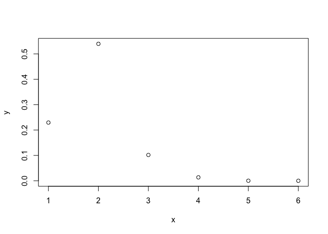
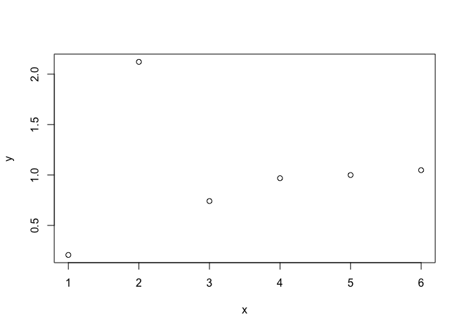
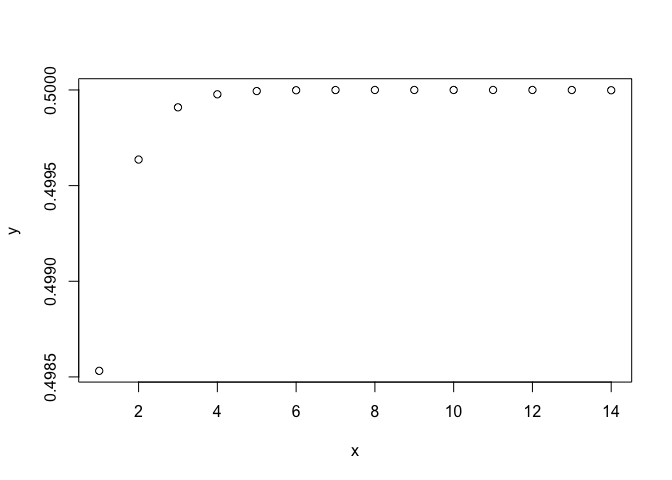
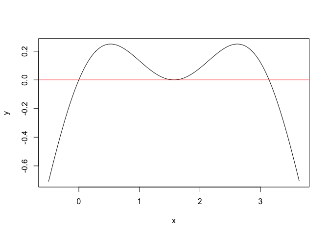
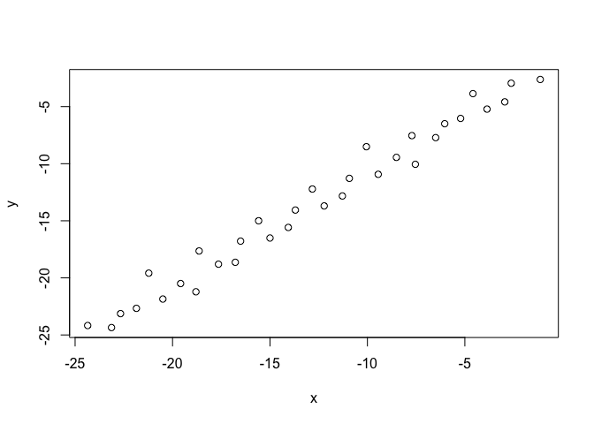
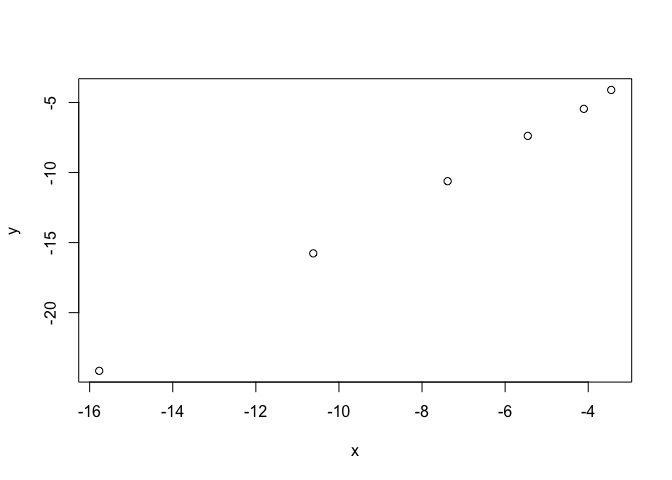

# Math 365 / Comp 365: Homework 2

### *Please bring a stapled hard copy of your answers to class, citing any collaborators.*

## Charles Zhang

### Problem 1

The function
```
f(x)=(cos(x))^2+sin(x)-1
```
has roots at both $\pi$ and $\pi/2$. 

a) Using the convergence properties we discussed in class, estimate how many iterations of the bisection method are necessary to find the accurate solution to eight correct decimal places, when we start with a bracketing interval of [2.5,3.5].

> $\frac{3.5-2.5}{2^{i+1}}<\frac{1}{2}\times10^{-8}$<br>
$\frac{1}{10^{-8}}<2^{i}$<br>
$\log 10^{8}<i\log2$<br>
$i>\frac{\log 10^{8}}{log2}=26.57542$<br>
$\therefore 27$ iterations of the bisection method are necessary to find the accurate solution to eight correct decimal places.


```r
log(10^8)/log(2)
```

```
## [1] 26.57542
```


b) Use your `bisect` function to see how many iterations it actually takes.


```r
f = function(x){
  return((cos(x))^2+sin(x)-1)
}
bisect = function(f,interval,tol=0.5*10^-10,max.its=40,verbose=FALSE){
  history = rep(NA, max.its)
  a = interval[1]
  b = interval[2]
  fa = f(a)
  fb = f(b)
  if (sign(fa)*sign(fb) >= 0 ) 
    stop("f(a)f(b)<0 not satisfied")
  for (j in 1:max.its){
    history[j] = (a+b)/2
    if ((b-a)/2 < tol) break
    fc = f(history[j])
    if (verbose==TRUE) {               # show values at each step for debugging
      print(j) 
      print(c(a,history[j],b,b-a))
    }
    if (fc == 0)  break
    if (sign(fc)*sign(fa) < 0) {
      b = history[j]
      fb = fc
    }
    else {
      a = history[j]
      fa = fc
    }
  }
  root=(a+b)/2
  return(list(root=root,history=history[!is.na(history)]))
}

options(digits = 9) 
interval <- c(2.5,3.5)
tol=0.5*10e-8
out=bisect(f,interval,tol=tol)
print(out$root)
```

```
## [1] 3.14159265
```

```r
print(out$history)
```

```
##  [1] 3.00000000 3.25000000 3.12500000 3.18750000 3.15625000 3.14062500
##  [7] 3.14843750 3.14453125 3.14257812 3.14160156 3.14111328 3.14135742
## [13] 3.14147949 3.14154053 3.14157104 3.14158630 3.14159393 3.14159012
## [19] 3.14159203 3.14159298 3.14159250 3.14159274 3.14159262 3.14159268
## [25] 3.14159265
```

> The accurate solution to eight correct decimal places is 3.14159265, and it is determined in bisection method after 25 iterations.

c) By hand, compute a formula for Newton's iteration for this particular choice of $f(x)$; i.e., write a formula for $x_{i+1}$ in terms of $x_{i}$.

> \(x_{n+1}=x_{n}-\frac{f\left(x_{n}\right)}{f^{\prime}\left(x_{n}\right)} \quad n=0,1,2, \ldots\)<br>
\(\therefore x_{n+1}=x_{n}-\frac{\cos ^{2} x_{n}+\sin x_{n} -1}{-\sin (2 x_{n})+\cos x_{n}}\)

d) Set $x_0$ to 4.25, run 50 iterations of your Newton's formula from c) to compute $\{x_i\}_{i=0,1,\ldots,50}$, and compute $e_i=|x_i-\pi|$ for all $i$. When does the iteration converge? Now plot $e_i / e_{i-1}$ over all $i$ until convergence. What is the convergence order and rate to $\pi$?


```r
newton=function(x,its){
  res=x
  while (its>0) {
    x<-x-((cos(x))^2+sin(x)-1)/(-sin(2*x)+cos(x))
    res=c(res,x)
    its<-its-1
  }
  return(res)
}
x<-4.25
newton(x,50)
```

```
##  [1] 4.25000000 2.88728915 3.27882990 3.15555930 3.14178152 3.14159269
##  [7] 3.14159265 3.14159265 3.14159265 3.14159265 3.14159265 3.14159265
## [13] 3.14159265 3.14159265 3.14159265 3.14159265 3.14159265 3.14159265
## [19] 3.14159265 3.14159265 3.14159265 3.14159265 3.14159265 3.14159265
## [25] 3.14159265 3.14159265 3.14159265 3.14159265 3.14159265 3.14159265
## [31] 3.14159265 3.14159265 3.14159265 3.14159265 3.14159265 3.14159265
## [37] 3.14159265 3.14159265 3.14159265 3.14159265 3.14159265 3.14159265
## [43] 3.14159265 3.14159265 3.14159265 3.14159265 3.14159265 3.14159265
## [49] 3.14159265 3.14159265 3.14159265
```

```r
e<-abs((newton(x,50)-pi))
e
```

```
##  [1] 1.10840735e+00 2.54303500e-01 1.37237243e-01 1.39666466e-02 1.88864538e-04
##  [6] 3.56541001e-08 1.33226763e-15 0.00000000e+00 4.44089210e-16 0.00000000e+00
## [11] 4.44089210e-16 0.00000000e+00 4.44089210e-16 0.00000000e+00 4.44089210e-16
## [16] 0.00000000e+00 4.44089210e-16 0.00000000e+00 4.44089210e-16 0.00000000e+00
## [21] 4.44089210e-16 0.00000000e+00 4.44089210e-16 0.00000000e+00 4.44089210e-16
## [26] 0.00000000e+00 4.44089210e-16 0.00000000e+00 4.44089210e-16 0.00000000e+00
## [31] 4.44089210e-16 0.00000000e+00 4.44089210e-16 0.00000000e+00 4.44089210e-16
## [36] 0.00000000e+00 4.44089210e-16 0.00000000e+00 4.44089210e-16 0.00000000e+00
## [41] 4.44089210e-16 0.00000000e+00 4.44089210e-16 0.00000000e+00 4.44089210e-16
## [46] 0.00000000e+00 4.44089210e-16 0.00000000e+00 4.44089210e-16 0.00000000e+00
## [51] 4.44089210e-16
```

```r
x=c(1:6)
y=e[2:7]/e[1:6]
plot(x,y)
```

<!-- -->

```r
x=c(1:6)
y=e[2:7]/e[1:6]^2
plot(x,y)
```

<!-- -->


> After around 6 iterations, it will become converge. The convergence order is $2$, and rate is around $1$.

e) Repeat d) with $x_0$=1.5. What is the convergence order and rate to $\pi/2$? If your answer is different from d), explain why.


```r
x<-1.5
e<-abs((newton(x,50)-pi/2))
x=c(1:14)
y=e[2:15]/e[1:14]
plot(x,y)
```

<!-- -->

```r
e
```

```
##  [1] 7.07963268e-02 3.52942144e-02 1.76342700e-02 8.81553517e-03 4.40756776e-03
##  [6] 2.20375890e-03 1.10187633e-03 5.50937775e-04 2.75468839e-04 1.37734413e-04
## [11] 6.88672057e-05 3.44336028e-05 1.72168029e-05 8.60839728e-06 4.30418594e-06
## [16] 2.15208682e-06 1.07605998e-06 5.38106426e-07 2.69064699e-07 1.34549577e-07
## [21] 6.68880584e-08 3.36916091e-08 1.39201042e-08 1.39201042e-08 1.39201042e-08
## [26] 1.39201042e-08 1.39201042e-08 1.39201042e-08 1.39201042e-08 1.39201042e-08
## [31] 1.39201042e-08 1.39201042e-08 1.39201042e-08 1.39201042e-08 1.39201042e-08
## [36] 1.39201042e-08 1.39201042e-08 1.39201042e-08 1.39201042e-08 1.39201042e-08
## [41] 1.39201042e-08 1.39201042e-08 1.39201042e-08 1.39201042e-08 1.39201042e-08
## [46] 1.39201042e-08 1.39201042e-08 1.39201042e-08 1.39201042e-08 1.39201042e-08
## [51] 1.39201042e-08
```

> The convergence order is $1$(linear), and rate is around $0.5$. It is different from d) since for the first root $\pi$:<br>
\(f\) is twice continuously differentiable and \(f(r)=0 \), \(f^{\prime}(r) \neq 0,\) then Newton's
Method is locally and quadratically convergent to \(r .\) The error \(e_{i}\) at step \(i\) satisfies
$$
\lim _{i \rightarrow \infty} \frac{e_{i+1}}{e_{i}^{2}}=\frac{f^{\prime \prime}(r)}{2 f^{\prime}(r)}=\frac{f^{\prime \prime}(\pi)}{2 f^{\prime}(\pi)}=\frac{-2}{2\times(-1)}=1
$$
$\therefore$ The convergence order is 2(quadratic), and the rate to $\pi$ is 1.<br>
On the other hand,<br>
$\because$ \(f^{\prime}(\pi/2)=0, f^{\prime \prime}(\pi/2)=1,f^{\prime\prime\prime}(\pi/2)=0\),<br> $\therefore$ the multiplicity of root \(\pi/2\) is 2. <br>
$\because$ \((m+1=3)\) -times continuously differentiable function \(f\) has a multiplicity \(2\) root at \(r=\pi/2.\) Then Newton's Method is locally convergent to \(r,\) and the error \(e_{i}\) at
step \(i\) satisfies
$$
\lim _{i \rightarrow \infty} \frac{e_{i+1}}{e_{i}}=S=\frac{(m-1)}{m}=\frac{2-1}{2}=\frac{1}{2}
$$
$\therefore$ The convergence order is 1(linear), and rate to $\pi/2$ is $1/2$.


```r
# Test for the multiplicity
x=seq(-0.5,pi+0.5,0.01)
y=(cos(x))^2+sin(x)-1
plot(x,y,type="l")
abline(0,0,col="red")
```

<!-- -->

> The multiplicity of the root $\pi/2$ is 2

### Problem 2
Computer Problem 7 from Section 1.1 of the book (involving a determinant). 

7. Use the Bisection Method to find the two real numbers \(x,\) within six correct decimal places, that make the determinant of the matrix
$$
A=\left[\begin{array}{llll}
{1} & {2} & {3} & {x} \\
{4} & {5} & {x} & {6} \\
{7} & {x} & {8} & {9} \\
{x} & {10} & {11} & {12}
\end{array}\right]
$$
equal to \(1000 .\) For each solution you find, test it by computing the corresponding determinant and reporting how many correct decimal places (after the decimal point) the determinant has when your solution \(x\) is used. (In Section \(1.2,\) we will call this the "backward error" " associated with the approximate solution.) 


```r
f=function(x){
  A<-cbind(c(1,4,7,x),c(2,5,x,10),c(3,x,8,11),c(x,6,9,12))
  return(det(A)-1000)
}
6*log(10)/log(2)
```

```
## [1] 19.9315686
```

```r
options(digits = 7) 
interval <- c(9,10)
out=bisect(f,interval,max.its = 20)
print(out$root)
```

```
## [1] 9.708299
```

```r
print(out$history)
```

```
##  [1] 9.500000 9.750000 9.625000 9.687500 9.718750 9.703125 9.710938 9.707031
##  [9] 9.708984 9.708008 9.708496 9.708252 9.708374 9.708313 9.708282 9.708298
## [17] 9.708305 9.708302 9.708300 9.708299
```

> The first root is 9.708299


```r
x<-9.708299
f(x)+1000 # corresponding determinant 
```

```
## [1] 999.9999
```

```r
f(x)
```

```
## [1] -0.0001407471
```

> Therefore, the determinant has to 3 correct decimal places.


```r
options(digits = 9) 
interval <- c(-18,-17)
out=bisect(f,interval)
print(out$root)
```

```
## [1] -17.1884982
```

```r
print(out$history)
```

```
##  [1] -17.5000000 -17.2500000 -17.1250000 -17.1875000 -17.2187500 -17.2031250
##  [7] -17.1953125 -17.1914062 -17.1894531 -17.1884766 -17.1889648 -17.1887207
## [13] -17.1885986 -17.1885376 -17.1885071 -17.1884918 -17.1884995 -17.1884956
## [19] -17.1884975 -17.1884985 -17.1884980 -17.1884983 -17.1884981 -17.1884982
## [25] -17.1884982 -17.1884982 -17.1884981 -17.1884982 -17.1884982 -17.1884982
## [31] -17.1884982 -17.1884982 -17.1884982 -17.1884982 -17.1884982
```

> The second root is -17.188498.


```r
x<--17.188498
f(x)+1000 # corresponding determinant 
```

```
## [1] 999.998192
```

```r
f(x)
```

```
## [1] -0.00180775118
```
> Therefore, the determinant has to 2 correct decimal places.


### Problem 3
Computer Problem 8 from Section 1.1 of the book (involving the Hilbert matrix)

8. The Hilbert matrix is the \(n \times n\) matrix whose ijth entry is \(1 /(i+j-1)\). Let \(A\) denote the
\(5 \times 5\) Hilbert matrix. Its largest eigenvalue is about \(1.567 .\) Use the Bisection Method to decide
how to change the upper left entry \(A_{11}\) to make the largest eigenvalue of \(A\) equal to \(\pi\).
Determine \(A_{11}\) within six correct decimal places. 


```r
require(Matrix)
A=Hilbert(5)

f=function(x){
  A[1,1]<-x
  return(det(A-pi*diag(1,5,5)))
}
options(digits = 8) 
interval <- c(0,10)
out=bisect(f,interval)
print(out$root)
```

```
## [1] 2.9480108
```

```r
print(out$history)
```

```
##  [1] 5.0000000 2.5000000 3.7500000 3.1250000 2.8125000 2.9687500 2.8906250
##  [8] 2.9296875 2.9492188 2.9394531 2.9443359 2.9467773 2.9479980 2.9486084
## [15] 2.9483032 2.9481506 2.9480743 2.9480362 2.9480171 2.9480076 2.9480124
## [22] 2.9480100 2.9480112 2.9480106 2.9480109 2.9480107 2.9480108 2.9480108
## [29] 2.9480108 2.9480108 2.9480108 2.9480108 2.9480108 2.9480108 2.9480108
## [36] 2.9480108 2.9480108 2.9480108
```

```r
A[1,1]<-2.948010
options(digits = 7)
max(eigen(A)$values)
```

```
## [1] 3.141592
```

> Use \(|\mathbf{A}-\lambda \cdot \mathbf{I}| = 0\) to calculate the eigenvalue, I got $A_{11} = 2.948010$ within six correct decimal places with the max eignevalue $\pi$.


### Problem 4
Write your own function to find square roots, using the idea that $sqrt(t)$ is a root of the function $f(x) = x^2 - t$, where $t$ is a positive number. Come up with an initial interval carefully inside your function. Make sure your function is commented, and use it to compute $\sqrt{4}, \sqrt{9}, \sqrt{16}$.


```r
my.sqrt=function(x){   # the number for square root finding
  f=function(t){      # t is the square root of x
    return(t^2-x)
  }
  return(bisect(f,c(0,10))$root)  # using bisection method get the t
}

my.sqrt(1)
```

```
## [1] 1
```

```r
my.sqrt(4)
```

```
## [1] 2
```

```r
my.sqrt(9)
```

```
## [1] 3
```

```r
my.sqrt(16)
```

```
## [1] 4
```


### Problem 5

This problem involves solving the equation
$$ \frac{r^3(2r^2+5\epsilon^2)}{2(r^2+\epsilon^2)^{5/2}}=0.9$$
Use the value $\epsilon=0.1$. From the context of the problem, it's clear that $r$ must be positive and $r$ might be close to $\epsilon$. 

a. Use your bisection code to solve the equation for $r$. Give ten digits of accuracy and report the number of bisection steps you used. _Hint:_ the R command `options(digits = 12)` can be used to print lots of digits.


```r
f=function(r){
  return((r^3*(2*r^2+5*0.1^2))/(2*(r^2+0.1^2)^(5/2))-0.9)
}
options(digits=10)
out=bisect(f,c(0,1))
out
```

```
## $root
## [1] 0.1772891798
## 
## $history
##  [1] 0.5000000000 0.2500000000 0.1250000000 0.1875000000 0.1562500000
##  [6] 0.1718750000 0.1796875000 0.1757812500 0.1777343750 0.1767578125
## [11] 0.1772460938 0.1774902344 0.1773681641 0.1773071289 0.1772766113
## [16] 0.1772918701 0.1772842407 0.1772880554 0.1772899628 0.1772890091
## [21] 0.1772894859 0.1772892475 0.1772891283 0.1772891879 0.1772891581
## [26] 0.1772891730 0.1772891805 0.1772891767 0.1772891786 0.1772891795
## [31] 0.1772891800 0.1772891798 0.1772891799 0.1772891798 0.1772891798
```

> The root is 0.1772891798<br>
$\frac{1-0}{2^{i+1}}<\frac{1}{2}\times10^{-10}$<br>
$10\log 10<i\log2$<br>
$i>\frac{10\log 10}{log2}=33.2$<br>
$\therefore 34$ iterations of the bisection method are necessary to find the accurate solution to ten correct decimal places, but the algorithm used 35 steps.


```r
10*log(10)/log(2)
```

```
## [1] 33.21928095
```


b. (From In-class Activity) Another method to determine the convergence order is to plot the log-log plot of the error data, i.e. plot $(\log e_i, \log e_{i+1})$. To see why, consider: 

- Turn the equation $e_{i+1}=Ce_i^q$ into a straight line by taking the log of both sides and manipulating the equation to look like $y=mx+b$.

> $\log e_{i+1}=q\log Ce_{i}=q\log e_{i}+q\log C$

- What do you notice about the slope of the straight line?

> When $(x,y)=(\log e_i, \log e_{i+1})$, the slope is $q$, which is the convergence order.

- Now, test that the bisection method for this data had linear convergence by plotting the log-log plot of the error data $(\log e_i, \log e_{i+1})$ and observing what the slope is (hint, the function `lm` can give the slope). Run your bisection code again and find a root correct to 15 digits; you may use this root as the "true root" in the error formula. Note, your plot will not be perfectly linear as this "true root" is actually just an approximation.

```r
15*log(10)/log(2)
```

```
## [1] 49.82892142
```

```r
options(digits=18)
(actual=bisect(f,c(0,1),tol = 0.5*10e-19,max.its = 100))
```

```
## $root
## [1] 0.177289179849030448
## 
## $history
##  [1] 0.500000000000000000 0.250000000000000000 0.125000000000000000
##  [4] 0.187500000000000000 0.156250000000000000 0.171875000000000000
##  [7] 0.179687500000000000 0.175781250000000000 0.177734375000000000
## [10] 0.176757812500000000 0.177246093750000000 0.177490234375000000
## [13] 0.177368164062500000 0.177307128906250000 0.177276611328125000
## [16] 0.177291870117187500 0.177284240722656250 0.177288055419921875
## [19] 0.177289962768554688 0.177289009094238281 0.177289485931396484
## [22] 0.177289247512817383 0.177289128303527832 0.177289187908172607
## [25] 0.177289158105850220 0.177289173007011414 0.177289180457592010
## [28] 0.177289176732301712 0.177289178594946861 0.177289179526269436
## [31] 0.177289179991930723 0.177289179759100080 0.177289179875515401
## [34] 0.177289179817307740 0.177289179846411571 0.177289179860963486
## [37] 0.177289179853687529 0.177289179850049550 0.177289179848230560
## [40] 0.177289179849140055 0.177289179848685308 0.177289179848912681
## [43] 0.177289179849026368 0.177289179849083212 0.177289179849054790
## [46] 0.177289179849040579 0.177289179849033474 0.177289179849029921
## [49] 0.177289179849031697 0.177289179849030809 0.177289179849030365
## [52] 0.177289179849030587 0.177289179849030476 0.177289179849030420
## [55] 0.177289179849030448
```


```r
aroot=0.177289179849030  # the root that has 15 correct decimals
(e<-(abs(out$history-aroot)))
```

```
##  [1] 3.22710820150969968e-01 7.27108201509699958e-02 5.22891798490300042e-02
##  [4] 1.02108201509699958e-02 2.10391798490300042e-02 5.41417984903000415e-03
##  [7] 2.39832015096999585e-03 1.50792984903000415e-03 4.45195150969995845e-04
## [10] 5.31367349030004155e-04 4.30860990300041546e-05 2.01054525969995845e-04
## [13] 7.89842134699958454e-05 1.79490572199958454e-05 1.25685209050041546e-05
## [16] 2.69026815749584536e-06 4.93912637375415464e-06 1.12442910812915464e-06
## [19] 7.82919524683345358e-07 1.70754791722904642e-07 3.06082366480220358e-07
## [22] 6.76637873786578581e-08 5.15455021721233919e-08 8.05914260326723308e-09
## [25] 2.17431797844280794e-08 6.84201859058042317e-09 6.08562006343404960e-10
## [28] 3.11672829211850910e-09 1.25408314288755207e-09 3.22760568272073556e-10
## [31] 1.42900719035665702e-10 8.99299246182039269e-11 2.64853972087308875e-11
## [34] 3.17222637047365197e-11 2.61843324800281607e-12
```

```r
x=log(e[1])
y=log(e[2])
for (i in 2:(length(e)-2)) {
  x=c(x,log(e[i]))
  y=c(y,log(e[i+1]))
}
plot(x,y)
```

<!-- -->

```r
lm(y~x)
```

```
## 
## Call:
## lm(formula = y ~ x)
## 
## Coefficients:
##        (Intercept)                   x  
## -0.959416888631163   0.979648488907936
```

> The slop is 0.979648488907936 approximately.

c. Implement the secant method for rootfinding (it is OK to modify your `bisect` code). Then use your secant code to solve for $r$. How many secant steps were used?


```r
secant.method <- function(f, x0, x1, tol = 0.5e-10, n = 100) {
  history = rep(NA, n) 
  for (i in 1:n) {
    x2 <- x1 - f(x1) / ((f(x1) - f(x0)) / (x1 - x0)) 
    if (abs(x2 - x1) < tol) {
      root=x2
      break
    }
    x0 <- x1
    x1 <- x2
    root=x2
    history=c(history,x2)
  }
  return(list(root=root,history=history[!is.na(history)]))
}
options(digits = 10)
(out=secant.method(f, 0, 0.1))
```

```
## $root
## [1] 0.1772891798
## 
## $history
## [1] 0.1454619664 0.1608191617 0.1730118290 0.1766681521 0.1772647067
## [6] 0.1772890382 0.1772891798
```

> Secant method only used 7 steps to find a result with 10 correct decimals

d. Create a log-log plot of the errors for the secant method. What does it seem like the convergence order is for this?


```r
aroot=0.177289179849030  # the root that has 15 correct decimals
(e<-(abs(out$history-aroot)))
```

```
## [1] 3.182721343e-02 1.647001815e-02 4.277350893e-03 6.210277200e-04
## [5] 2.447310410e-05 1.416516389e-07 3.236330648e-11
```

```r
x=log(e[1:6])
y=log(e[2:7])
plot(x,y)
```

<!-- -->

```r
lm(y~x)
```

```
## 
## Call:
## lm(formula = y ~ x)
## 
## Coefficients:
## (Intercept)            x  
##    1.358693     1.616903
```

> The convergence order is around the golden ratio, $\frac{1+\sqrt 5}{2}$


