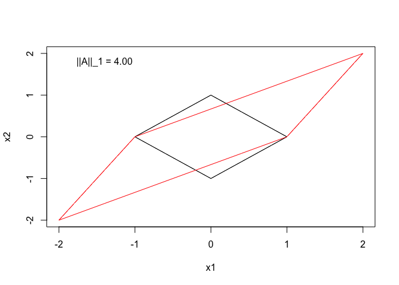
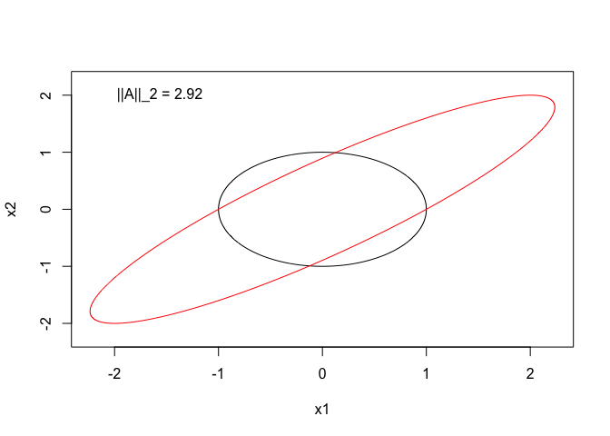
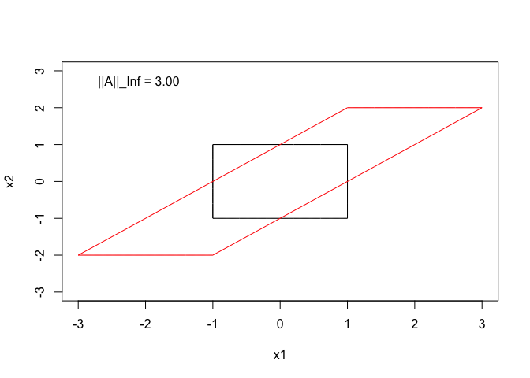
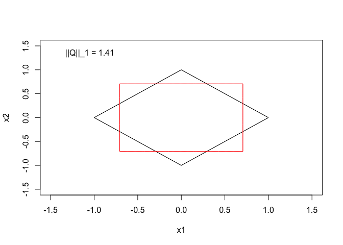
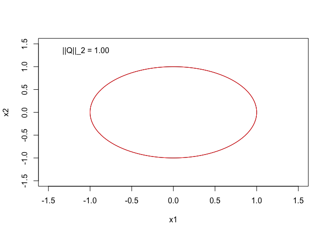
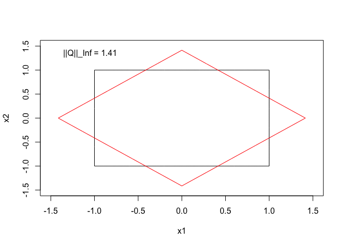

### Problem 1
**In class, we showed how to construct a sequence of unit lower-triangular matrices $\{L_{k}\}_{k=1,2,\ldots,n-1}$ of the form** 

$$ 
L_{k}=\begin{pmatrix} 1 & & & & & \\
& \ddots & & & & \\
& & 1 & & & \\
& & -\ell_{k+1,k} & 1 & & \\
& & \ddots & & \ddots & \\
& & -\ell_{n,k} & &  & 1 
\end{pmatrix}~, \hbox{ where } \ell_{j,k}=\frac{A_{j,k}}{A_{k,k}},~\hbox{ for } k\leq j \leq n, 
$$

**such that**

$$ L_{n-1} L_{n-2} \ldots L_{2} L_{1} A = U, $$ 

**with $U$ being an upper-triangular matrix. We now want to show in two steps that**

$$L:= L_{1}^{-1} L_{2}^{-1} \ldots L_{n-2}^{-1} L_{n-1}^{-1} $$

**is a unit lower-triangular matrix.**

**(a) Show that**

$$  
L_{k}^{-1} = \begin{pmatrix} 1 & & & & & \\
& \ddots & & & & \\
& & 1 & & & \\
& & \ell_{k+1,k} & 1 & & \\
& & \ddots & & \ddots & \\
& & \ell_{n,k} & &  & 1 
\end{pmatrix}. 
$$

**Hint**: **Start by showing that $L_k=I-\ell_k e_k^{\top}$, where $e_k$ is an $n \times 1$ vector with a 1 in the $k^{th}$ entry, and zeros elsewhere, and**

$$ \ell_k = \begin{pmatrix} 0 \\ \vdots \\ 0 \\ \ell_{k+1,k} \\ \vdots \\ \ell_{n,k} \end{pmatrix}. $$
<br><br>

*Solution:*

>$$
\begin{array}{l}{L_{k}=I-\ell_{k} e_{k}^{\top}} \\ 
{L_{k} (I-\ell_{k}e_{k}^{\top})=(I-\ell_{k}e_{k}^{\top})(I+\ell_{k}e_{k}^{\top})} \\ 
{=I+\ell_{k} e_{k}^{\top}-\ell_{k} e_{k}^{\top}-\ell_{k} e_{k}^{\top} \ell_{k} e_{k}^{\top}} \\ 
{\because e_{k}^{\top} \ell_{k}=0} \\ 
{\therefore L_{k}\left(I+\ell_{k} e_{k}^{\top}\right)=I} \\ 
{L_{k}^{-1}=I+\ell_{k} e_{k}^{\top}}\end{array} \\
= \begin{pmatrix} 1 & & & & & \\
& \ddots & & & & \\
& & 1 & & & \\
& & \ell_{k+1,k} & 1 & & \\
& & \ddots & & \ddots & \\
& & \ell_{n,k} & &  & 1 
\end{pmatrix}
$$

<br>
<br>
<br>
**(b) Now show that**

$$L:= L_{1}^{-1} L_{2}^{-1} \ldots L_{n-2}^{-1} L_{n-1}^{-1} = \begin{pmatrix} 1 & & & & \\
\ell_{21} & 1 & & & \\
\ell_{31} & \ell_{32} & 1 & &  \\
\vdots & \vdots & \ddots & \ddots & \\
\ell_{n1} & \ell_{n2} & \cdots & \ell_{n,n-1} & 1    \\
\end{pmatrix}
$$

<br><br><br>

*Solution:*

>
$$
\because \forall k\leq j\leq n \text{, }\text{ }\text{ }e_{k}^{\top} \ell_{j}=0  \\
\begin{array}{c}\therefore {L_{k}^{-1} L_{k+1}^{-1}=\left(I+\ell_{k} e_{k}^{\top}\right)\left(I+\ell_{k+1} e_{k+1}^{\top}\right)=I+\ell_{k} e_{k}^{\top}+\ell_{k+1} e_{k+1}^{\top}+\ell_{k} e_{k}^{\top} \ell_{k+1} e_{k+1}^{\top} \\
=I+\ell_{k} e_{k}^{\top}+\ell_{k+1} e_{k+1}^{\top}} \\ 
\begin{aligned} L_{k}^{-1} L_{k+1}^{-1} L_{k+2}^{-1} &=\left(I+\ell_{k} e_{k}^{\top}+\ell_{k+1} e_{k+1}^{\top}\right)\left(I+\ell_{k+2}e_{k+2}^{\top}\right) \\ &=I+l_{k} e_{k}^{\top}+l_{k+1} e_{k+1}^{\top}+l_{k+2}^{\top} k_{k+2}^{\top}+0 \end{aligned} \\
......\\
{\therefore L:=L_{1}^{-1} L_{2}^{-1} \ldots L_{n-2}^{-1} L_{n-1}^{-1}=I+\ell_{1} e_{1}^{\top}+\ell_{2} e_{2}^{\top}+\ldots+\ell_{n-1} e_{n-1}^{\top}=\left(\begin{array}{cccc}{1} & {} & {} & {} \\
{\ell_{31}} & {\ell_{32}} & {1} & {} \\ {\vdots} & {\vdots} & {\ddots} & {\ddots} \\ {\ell_{n 1}} & {\ell_{n 2}} & {\cdots} & {\ell_{n, n-1}}\end{array}\right)}\end{array}
$$

<br><br><br>

### Problem 2

**This was Exercise 2 on the $LU$ Activity**

*This problem is from Section 2.5, page 131 of Linear Algebra and Its Applications, by David Lay, the textbook many of you used for MATH 236.*


**An important concern in the study of heat transfer is to determine the steady-state temperature distribution of a thin plate when the temperature around the boundary is known. Assume the plate shown in the figure above represents a cross section of a metal beam, with negligible heat flow in the direction perpendicular to the plate. Let the variables $x_1, x_2, \ldots, x_8$ denote the temperatures at nodes 1 through 8 in the picture. In steady state, the temperature at a node is approximately equal to the average of the four nearest nodes (to the left, above, right, below).**

**a) The solution to the approximate steady-state heat flow problem for this plate can be written as a system of linear equations $Ax=b$, where $x=[x_1, x_2, \ldots, x_8]$ is the vector of temperatures at nodes 1 through 8. Find the $8 \times 8$ matrix $A$ and the vector $b$. Hint: $A$ should be a banded matrix with many zeros in the top right and bottom left parts of $A$.**

*Solution* 

>
$$
x_{1} = 1/4(0+5+x_{3}+x_{2})\\
x_{2} = 1/4(10+5+x_{1}+x_{4})\\
x_{3} = 1/4(0+x_{1}+x_{4}+x_{5})\\
x_{4} = 1/4(10+x_{6}+x_{2}+x_{3})\\
x_{5} = 1/4(0+x_{7}+x_{3}+x_{6})\\
x_{6} = 1/4(10+x_{5}+x_{4}+x_{8})\\
x_{7} = 1/4(0+20+x_{5}+x_{8})\\
x_{8} = 1/4(10+20+x_{6}+x_{7})\\
\therefore
x_{1}\left[\begin{array}{r} {4} \\ {-1} \\ {-1} \\ {0} \\ {0} \\ {0} \\ {0} \\ {0}\end{array}\right] +
x_{2}\left[\begin{array}{r} {-1} \\ {4} \\ {0} \\ {-1} \\ {0} \\ {0} \\ {0} \\ {0}\end{array}\right] +
x_{3}\left[\begin{array}{r} {-1} \\ {0} \\ {4} \\ {-1} \\ {-1} \\ {0} \\ {0} \\ {0}\end{array}\right] +
x_{4}\left[\begin{array}{r} {0} \\ {-1} \\ {-1} \\ {4} \\ {0} \\ {-1} \\ {0} \\ {0}\end{array}\right] +
x_{5}\left[\begin{array}{r} {0} \\ {0} \\ {-1} \\ {0} \\ {4} \\ {-1} \\ {-1} \\ {0}\end{array}\right] +
x_{6}\left[\begin{array}{r} {0} \\ {0} \\ {0} \\ {-1} \\ {-1} \\ {4} \\ {0} \\ {-1}\end{array}\right] +
x_{7}\left[\begin{array}{r} {0} \\ {0} \\ {0} \\ {0} \\ {-1} \\ {0} \\ {4} \\ {-1}\end{array}\right] +
x_{8}\left[\begin{array}{r} {0} \\ {0} \\ {0} \\ {0} \\ {0} \\ {-1} \\ {-1} \\ {4}\end{array}\right] = 
\left[\begin{array}{r} {5} \\ {15} \\ {0} \\ {10} \\ {0} \\ {10} \\ {20} \\ {30}\end{array}\right] \\
\therefore A=\left[\begin{array}{rrrrrrrr}{4} & {-1} & {-1} & {0} & {0} & {0} & {0} & {0} \\ 
{-1} & {4} & {0} & {-1} & {0} & {0} & {0} & {0} \\ 
{-1} & {0} & {4} & {-1} & {-1} & {0} & {0} & {0} \\ 
{0} & {-1} & {-1} & {4} & {0} & {-1} & {0} & {0} \\ 
{0} & {0} & {-1} & {0} & {4} & {-1} & {-1} & {0} \\ 
{0} & {0} & {0} & {-1} & {-1} & {4} & {0} & {-1} \\ 
{0} & {0} & {0} & {0} & {-1} & {0} & {4} & {-1} \\ 
{0} & {0} & {0} & {0} & {0} & {-1} & {-1} & {4}\end{array}\right]
\quad b = \left[\begin{array}{r} {5} \\ {15} \\ {0} \\ {10} \\ {0} \\ {10} \\ {20} \\ {30}\end{array}\right] 
$$

**b) Use your function from Exercise 1 (on the activity) to perform an LU factorization of $A$. Do you notice anything special about the structures of $L$ and $U$?**

*Solution*


```r
myLU = function(A,tol=10^-20) {
  n = nrow(A)
  L = diag(x=1,nrow=n)  
  U=A
  for ( k in 1:(n-1) ) {
    pivot = U[k,k]
    if (abs(pivot) < tol) stop('zero pivot encountered')
    for ( j in (k+1):n ) {
      mult =  U[j,k]/pivot
      U[j,] = U[j,] - mult * U[k,]
      L[j,k] = mult   
    }
  }
  return(list(L=L,U=U))
}
```

```r
A=cbind(c(4,-1,-1,0,0,0,0,0),c(-1,4,0,-1,0,0,0,0),c(-1,0,4,-1,-1,0,0,0),c(0,-1,-1,4,0,-1,0,0),c(0,0,-1,0,4,-1,-1,0),c(0,0,0,-1,-1,4,0,-1),c(0,0,0,0,-1,0,4,-1),c(0,0,0,0,0,-1,-1,4))
(out=myLU(A))
```

```
## $L
##       [,1]        [,2]       [,3]        [,4]       [,5]        [,6]
## [1,]  1.00  0.00000000  0.0000000  0.00000000  0.0000000  0.00000000
## [2,] -0.25  1.00000000  0.0000000  0.00000000  0.0000000  0.00000000
## [3,] -0.25 -0.06666667  1.0000000  0.00000000  0.0000000  0.00000000
## [4,]  0.00 -0.26666667 -0.2857143  1.00000000  0.0000000  0.00000000
## [5,]  0.00  0.00000000 -0.2678571 -0.08333333  1.0000000  0.00000000
## [6,]  0.00  0.00000000  0.0000000 -0.29166667 -0.2921348  1.00000000
## [7,]  0.00  0.00000000  0.0000000  0.00000000 -0.2696629 -0.08612836
## [8,]  0.00  0.00000000  0.0000000  0.00000000  0.0000000 -0.29482402
##            [,7] [,8]
## [1,]  0.0000000    0
## [2,]  0.0000000    0
## [3,]  0.0000000    0
## [4,]  0.0000000    0
## [5,]  0.0000000    0
## [6,]  0.0000000    0
## [7,]  1.0000000    0
## [8,] -0.2931381    1
## 
## $U
##      [,1]  [,2]      [,3]      [,4]       [,5]      [,6]       [,7]
## [1,]    4 -1.00 -1.000000  0.000000  0.0000000  0.000000  0.0000000
## [2,]    0  3.75 -0.250000 -1.000000  0.0000000  0.000000  0.0000000
## [3,]    0  0.00  3.733333 -1.066667 -1.0000000  0.000000  0.0000000
## [4,]    0  0.00  0.000000  3.428571 -0.2857143 -1.000000  0.0000000
## [5,]    0  0.00  0.000000  0.000000  3.7083333 -1.083333 -1.0000000
## [6,]    0  0.00  0.000000  0.000000  0.0000000  3.391854 -0.2921348
## [7,]    0  0.00  0.000000  0.000000  0.0000000  0.000000  3.7051760
## [8,]    0  0.00  0.000000  0.000000  0.0000000  0.000000  0.0000000
##           [,8]
## [1,]  0.000000
## [2,]  0.000000
## [3,]  0.000000
## [4,]  0.000000
## [5,]  0.000000
## [6,] -1.000000
## [7,] -1.086128
## [8,]  3.386790
```


> L and U are banded matrices with many zeros in the top right and bottom left parts of L and U.

**c) Once you have an LU factorization for a matrix $A$, you need to do the two-step procedure to complete the back substitution to solve $Ax=b$. Here is code for that:**


```r
mySolve=function(L,U,b,tol=1e-10){

  n=nrow(L)
  
  # First solve Ly=b 
  y = rep(0,n)        # pre-allocate a vector y with 0s in it.
  if(abs(L[1,1])<tol) stop('There is a zero on the diagonal of L')
  y[1] = b[1]/L[1,1]  # Fill in the 1st value of y
  for (j in 2:n ) {
    if(abs(L[j,j])<tol) stop('There is a zero on the diagonal of L')
    y[j] = (b[j] - L[j,1:(j-1)]%*%y[1:(j-1)])/L[j,j]
  }

  # Then solve Ux=y 
  x = rep(0,n)        # pre-allocate a vector x with 0s in it.
  if(abs(U[n,n])<tol) stop('There is a zero on the diagonal of U')
  x[n] = y[n]/U[n,n]  # Fill in the nth value of x
  for (j in (n-1):1 ) {
    if(abs(U[j,j])<tol) stop('There is a zero on the diagonal of U')
    x[j] = (y[j] - U[j,(j+1):n]%*%x[(j+1):n])/U[j,j]
  }
  return(x)
}
```

**Make sure you understand what the code is doing, and then use it to find the steady-state temperatures at nodes 1 through 8.**

*Solution*


```r
b=c(5,15,0,10,0,10,20,30)
(x=mySolve(out$L,out$U,b))
```

```
## [1]  3.956938  6.588517  4.239234  7.397129  5.602871  8.760766  9.411483
## [8] 12.043062
```

**d) The temperature on the right-hand side of the plate was measured incorrectly. It is actually 30 degrees. Find the new steady-state temperatures. Hint: you should not do another LU factorization!** 

*Solution*


```r
b[7]=30
b[8]=40
(x=mySolve(out$L,out$U,b))
```

```
## [1]  4.138756  6.770335  4.784689  7.942584  7.057416 10.215311 13.229665
## [8] 15.861244
```


**e) Use the R function `solve(A)` to compute $A^{-1}$. Note that $A^{-1}$ is a dense matrix (without many zeros). When $A$ is large, $L$ and $U$ can be stored in much less space than $A^{-1}$. This fact is another reason for preferring the LU factorization of $A$ to $A^{-1}$ itself.**

*Solution* 


```r
solve(A)
```

```
##             [,1]        [,2]       [,3]       [,4]       [,5]       [,6]
## [1,] 0.295264808 0.086553374 0.09450586 0.05094869 0.03180993 0.02273552
## [2,] 0.086553374 0.295264808 0.05094869 0.09450586 0.02273552 0.03180993
## [3,] 0.094505857 0.050948688 0.32707474 0.10928890 0.10450421 0.05913216
## [4,] 0.050948688 0.094505857 0.10928890 0.32707474 0.05913216 0.10450421
## [5,] 0.031809932 0.022735522 0.10450421 0.05913216 0.32707474 0.10928890
## [6,] 0.022735522 0.031809932 0.05913216 0.10450421 0.10928890 0.32707474
## [7,] 0.009998350 0.008183468 0.03180993 0.02273552 0.09450586 0.05094869
## [8,] 0.008183468 0.009998350 0.02273552 0.03180993 0.05094869 0.09450586
##             [,7]        [,8]
## [1,] 0.009998350 0.008183468
## [2,] 0.008183468 0.009998350
## [3,] 0.031809932 0.022735522
## [4,] 0.022735522 0.031809932
## [5,] 0.094505857 0.050948688
## [6,] 0.050948688 0.094505857
## [7,] 0.295264808 0.086553374
## [8,] 0.086553374 0.295264808
```

<br><br><br>


### Problem 3

***This problem is taken from the in-class portion of an old midterm.***

**You are trying to solve a linear system of four equations:**

$$\left[\begin{array}{ccc} && \\ & A &   \\ && \\ && \end{array}\right]
\left[\begin{array}{c}x_1 \\ x_2 \\ x_3 \\ x_4 \end{array}\right]=\left[\begin{array}{c}3 \\ -2 \\ 4 \\ 2.25 \end{array}\right]~,$$
**but unfortunately $A$ is a black box and you cannot see the contents. Oh my! Luckily, from the physics of the problem, you do have three pieces of information about the system and the solution:**

- $||x||_{\infty}=2$

- **The condition number of $A$, using the $\infty$-norm, is 32**

- **$\left[\begin{array}{ccc} && \\ & A &   \\ && \\ && \end{array}\right]
\left[\begin{array}{r}2.0750 \\ 0.1625 \\ 0.4500 \\ -0.1875 \end{array}\right]=\left[\begin{array}{c}3 \\ -2 \\ 4 \\ 2.1875 \end{array}\right]$**

**Is this information enough to determine the solution $x$ to $Ax=b$? If yes, find $x$. If no, say as much as you can about $x$.**

<br>

*Solution*

$$
Cond(A)=||A||_{\infty}||A^{-1}||_{\infty}=32=\max\frac{\text { relative forward error }}{\text { relative backward error }} \geq \frac{\frac{\left\|x-x_{a}\right\|_{\infty}}{\|x\|_{\infty}}}{\frac{\left\|A x_{a}-b\right\|_{\infty}}{\|b\|_{\infty}}} \geq   \frac{\frac{\left\|x-x_{a}\right\|_{\infty}}{2}}{\frac{|2.25-2.1875|}{4}}
$$


```r
32*(2.25-2.1875)/2
```

```
## [1] 1
```

>$$
\therefore ||x-x_{a}||_{\infty} \leq 1\\
\because ||x||_{\infty} = 2 = \max\{|\bar{x}|\} \text{ and } x_{a}=\left[\begin{array}{c}2.0750 \\ 0.1625 \\ 0.4500 \\ -0.1875 \end{array}\right]\\
\therefore |x_{i}-x_{ai}|\leq 1 \; i=1,2,3,4 \\
\therefore |x_{1}|=2\\
\text{and:  } 
\begin{aligned}-0.8375 & \leq x_{2} \leq 1.1625 \\-0.55 & \leq x_{3} \leq 1.45 \\-1.1875 & \leq x_{4} \leq 0.8125 \end{aligned}
$$

> I believe this is what we can find for $x$

<br>

### Problem 4

**A real $n \times n$ matrix $Q$ is *orthonormal* if** 

$$ Q^{\top}Q=QQ^T=I;~i.e., Q^{-1}=Q^T.$$

**Note: sometimes you will see these matrices just called *orthogonal matrices*. The analagous matrices that contain complex entries ($Q^*Q=QQ^*=I$, where the $~^*$ is a conjugate transpose) are called *unitary*.**

**Show that $||Q||_2=||Q^{-1}||_2=1$, and therefore the 2-norm condition number of any orthonormal matrix $Q$ is $\kappa_2(Q)=||Q||_2 ||Q^{-1}||_2=1$.**
<br>
<br>

*Proof*

>
$$
\|Q\|_2=\max_{\|x\|\neq 0}\frac{\|Qx\|_{2}}{\|x\|_2}=\max_{\|x\|\neq 0}(\frac{\|Qx\|_{2}^2}{\|x\|_2^2})^{1/2} 
= \max_{\|x\|\neq0} (\frac{\left(Qx\right)^{\top} Qx}{x^{\top}x})^{1/2} =\max_{\|x\|\neq0} (\frac{x^{\top} Q^{\top} Qx}{x^{\top}x})^{1/2} 
= \max_{\|x\|\neq0} (\frac{x^{\top} x}{x^{\top}x})^{1/2} \\
= \max_{\|x\|\neq0} (\frac{x^{\top} Q Q^{\top}x}{x^{\top}x})^{1/2} 
= \max_{\|x\|\neq0} (\frac{x^{\top} (Q^{-1})^{\top} Q^{-1}x}{x^{\top}x})^{1/2}
=\max_{\|x\|\neq 0}(\frac{\left(Q^{-1}x\right)^{\top} Q^{-1}x}{x^{\top}x})^{1/2}
=\max_{\|x\|\neq 0}\frac{\|Q^{-1}x\|_{2}}{\|x\|_2}
=\|Q^{-1}\|_{2}
= 1
\\
\therefore ||Q||_2=||Q^{-1}||_2=1  \\
\therefore \kappa_2(Q)=||Q||_2 ||Q^{-1}||_2=1
$$

<br><br>

### Problem 5

**This problem has 3 parts.**

**(a) Modify my `UnitCircleMap` function, which shows the image of the unit ball under a linear mapping $A$ and computes the matrix norm of $A$. We want to let the user choose the norm to be 1, 2, or $\infty$ ("I"). The code is below, and there are a few places where you need to insert a few lines.** 


```r
UnitCircleMap = function(A,p=2) {
  
  if (p==2) {
    t = seq(0,2*pi,len=1000)
    x = cos(t)
    y = sin(t)
    nn=norm(A,type="2")
    ni=as.character(p)
  }
  else if (p==1){
    # Insert some code here to create points along the unit 1-norm circle
    x=c(seq(1,0,len=500),seq(0,-1,len=500),seq(-1,0,len=500),seq(0,1,len=500))
    y=c(seq(0,1,len=500),seq(1,0,len=500),seq(0,-1,len=500),seq(-1,0,len=500))
    nn=norm(A,type="1")
    ni=as.character(p)
  }
  else if (p=="I"){
    # Insert some code here to create points along the unit infinity-norm circle
    x=c(rep(1,500),seq(1,-1,len=500),rep(-1,500),seq(-1,1,len=500))
    y=c(seq(-1,1,len=500),rep(1,500),seq(1,-1,len=500),rep(-1,500))
    nn=norm(A,type="I")
    ni="Inf"
  }
  
  pts = A %*% t(cbind(x,y))
  
  newx = pts[1,]
  newy = pts[2,]
  
  M = max(c(newx,newy,1.5))
  m = min(c(newx,newy,-1.5))
  
  plot(x,y,type='l',col='black',xlim=c(m,M),ylim=c(m,M),xlab="x1",ylab="x2")
  lines(newx,newy,col='red')
  
  normSize=sprintf("||A||_%s = %1.2f",ni,nn)
  text(-.7*M,.9*M,normSize)
}
```

**Here is an example of how the function should be called, and the output it should display. In this case, $A=\begin{bmatrix}1 & 2 \\ 0 & 2\end{bmatrix}$. Once you've filled in the missing lines of the function, you can also test your code on this $A$ with the 1 norm and $\infty$-norm.**


```r
A=cbind(c(1,0),c(2,2))
UnitCircleMap(A,p=2)
```

<!-- -->

```r
A=cbind(c(1,0),c(2,2))
UnitCircleMap(A,p=1)
```

<!-- -->

```r
A=cbind(c(1,0),c(2,2))
UnitCircleMap(A,p='I')
```

<!-- -->

**(b) Compute the condition number of the matrix $A$ above using `Cond` (using the $p=1,2, \infty$-norms). Visually explain why the condition number for each $p$ is the value you found.**

*Solution*


```r
Cond = function(A,p=2) {
  if (p == 2) {  # by default use the 
    s = svd(A)$d
    s = s[s>0]
    return(max(s)/min(s))
  }
  if (p == 1) {  # use the 1 norm
    Ainv = solve(A)
    return(max(colSums(abs(A)))*max(colSums(abs(Ainv))))
  }
  if (p == 'I') {   # use the infinity norm
    Ainv = solve(A)
    return(max(rowSums(abs(A)))*max(rowSums(abs(Ainv))))
  }
}
```


```r
A=cbind(c(1,0),c(2,2))
Cond(A,1)
```

```
## [1] 6
```

```r
Cond(A,2)
```

```
## [1] 4.265564
```

```r
Cond(A,"I")
```

```
## [1] 6
```


```r
Ainv = solve(A)
norm(Ainv,"1")
```

```
## [1] 1.5
```

```r
norm(Ainv,"2")
```

```
## [1] 1.460405
```

```r
norm(Ainv,"I")
```

```
## [1] 2
```

> The product of the norm of matrix A showing in figures and inverse of A is the condition number.

**(c) Use your code to determine whether $||Q||_1=||Q||_{\infty}=||Q||_2=1$ for all orthonormal matrices $Q$. **

**Hint: Try $Q=\begin{pmatrix}
\frac{1}{\sqrt{2}} & \frac{-1}{\sqrt{2}} \\
\frac{1}{\sqrt{2}} & \frac{1}{\sqrt{2}} \end{pmatrix}$, which is a rotation matrix that rotates vectors counter-clockwise by $\frac{\pi}{4}$.**

*Solution*


```r
A=cbind(c(1/sqrt(2),1/sqrt(2)),c(-1/sqrt(2),1/sqrt(2)))
UnitCircleMap(A,p=1)
```

<!-- -->

```r
UnitCircleMap(A,p=2)
```

<!-- -->

```r
UnitCircleMap(A,p="I")
```

<!-- -->

> Therefore, they are not necessarily equal to 1.
 
### Problem 6

**This was Question 5 on the Activity on norms.**

**Prove that**
$$ ||A||_{\infty}=\max_{1 \leq i \leq n}\left\{ \sum_{j=1}^n |A_{ij}| \right\}=\text{maximum absolute row sum}.$$


*Proof*

$$
\because ||x||_{\infty} = \max_{1 \leq i\leq n}\{|\bar{x_i}|\}\\
\therefore ||A||_{\infty}=\max_{||x||_{\infty}=1}\{||Ax||_{\infty}\}=\max_{||x||_{\infty}=1}\max_{1 \leq i \leq n}\{\sum^{n}_{j=1}|A_{ij}x_{j}|\}=\max_{1 \leq i \leq n}\max_{||x||_{\infty}=1}\{\sum^{n}_{j=1}|A_{ij}x_{j}|\} \\= 
\max_{1 \leq i \leq n}\left\{ \sum_{j=1}^n |A_{ij}| \right\}=\text{maximum absolute row sum}.
$$


### Problem 7
**Solve the following system by finding the $PA=LU$ factorization and then carrying out the two-step back substitution (all by hand, that is, not using any R functions. Of course, you can type your solution, and check your work in R, though.):**

$$ Ax=\begin{pmatrix}-1 & 0 & 1 \\
3 & 1 & 1 \\
2 & 0 & 1 
\end{pmatrix} \begin{pmatrix} x_1 \\ x_2\\ x_3\end{pmatrix}=\begin{pmatrix} 2 \\ 5 \\ 5 \end{pmatrix}=b. $$

*Solution*

>
$$
U = A = \begin{pmatrix}-1 & 0 & 1 \\
3 & 1 & 1 \\
2 & 0 & 1 
\end{pmatrix}\text{, } P = I =\left(\begin{array}{ccc}{1} & {0} & {0} \\ {0} & {1} & {0} \\ {0} & {0} & {1}\end{array}\right) \\
\text{exchange the first two rows: }U  = \begin{pmatrix}3 & 1 & 1 \\-1 & 0 & 1 \\
2 & 0 & 1 
\end{pmatrix} \text{, } P  =\left(\begin{array}{ccc}{0} & {1} & {0} \\ {1} & {0} & {0} \\ {0} & {0} & {1}\end{array}\right)\\
$$
$$
U = \left(\begin{array}{ccc}{3} & {1} & {1} \\ {-1} & {0} & {1} \\ {2} & {0} & {1}\end{array}\right) \frac{row2=\frac{1}{3} row1+row2}{row3=row3-\frac{2}{3} row1}\left(\begin{array}{rrr}{3} & {1} & {1} \\ {0} & {\frac{1}{3}} & {\frac{4}{3}} \\ {0} & {-\frac{2}{3}} & {\frac{1}{3}}\end{array}\right)   \quad
L=\left(\begin{array}{ccc}{1} & {0} & {0} \\ {-\frac{1}{3}} & {1} & {0} \\ {\frac{2}{3}} & {0} & {1}\end{array}\right) 
$$
$$
\text{exchange the last two rows: }U  = \left(\begin{array}{rrr}{3} & {1} & {1} \\  {0} & {-\frac{2}{3}} & {\frac{1}{3}} \\ {0} & {\frac{1}{3}} & {\frac{4}{3}} \end{array}\right) \quad 
P  =\left(\begin{array}{ccc}{0} & {1} & {0} \\ {0} & {0} & {1} \\ {1} & {0} & {0}\end{array}\right) \quad
L=\left(\begin{array}{ccc}{1} & {0} & {0} \\{\frac{2}{3}} & {1} & {0} \\ {-\frac{1}{3}} & {0} & {1} \end{array}\right) 
$$
$$
row3=\frac{1}{2} row2+row3:
U=\left(\begin{array}{ccc}
{3} & {1} & {1} \\
{0} & {-\frac{2}{3}} & {\frac{1}{3}} \\
{0} & {0} & {\frac{3}{2}}
\end{array}\right) \quad L=\left(\begin{array}{ccc}
{1} & {0} & {0} \\
{\frac{2}{3}} & {1} & {0} \\
{-\frac{1}{3}} & {-\frac{1}{2}} & {1}
\end{array}\right) \quad P=\left(\begin{array}{lll}
{0} & {1} & {0} \\
{0} & {0} & {1} \\
{1} & {0} & {0}
\end{array}\right)
$$

>
$$
Ly=Pb:\\
\left(\begin{array}{ccc}
{1} & {0} & {0} \\
{\frac{2}{3}} & {1} & {0} \\
{-\frac{1}{3}} & {-\frac{1}{2}} & {1}
\end{array}\right) y = \left(\begin{array}{lll}
{0} & {1} & {0} \\
{0} & {0} & {1} \\
{1} & {0} & {0}
\end{array}\right) \left(\begin{array}{l}{2} \\ {5} \\ {5} \end{array}\right) \\
\therefore y=\left(\begin{array}{c}{5} \\ {\frac{5}{3}} \\ {\frac{9}{2}}\end{array}\right)
\\
Ux = y:\\
\left(\begin{array}{ccc}
{3} & {1} & {1} \\
{0} & {-\frac{2}{3}} & {\frac{1}{3}} \\
{0} & {0} & {\frac{3}{2}}
\end{array}\right) x =\left(\begin{array}{c}{5} \\ {\frac{5}{3}} \\ {\frac{9}{2}}\end{array}\right) \\
\therefore x=\left(\begin{array}{c}{1} \\ {-1} \\ {3}\end{array}\right)
$$


```r
# Test
P = cbind(c(0,1,0),c(1,0,0),c(0,0,1))
A = rbind(c(-1,0,1),c(3,1,1),c(2,0,1))
L = cbind(c(1,2/3,-1/3),c(0,1,-1/2),c(0,0,1))
U = cbind(c(3,0,0),c(1,-2/3,0),c(1,1/3,3/2))
P %*% A
```

```
##      [,1] [,2] [,3]
## [1,]    3    1    1
## [2,]   -1    0    1
## [3,]    2    0    1
```

```r
L %*% U
```

```
##      [,1] [,2] [,3]
## [1,]    3    1    1
## [2,]    2    0    1
## [3,]   -1    0    1
```

```r
b = c(2,5,5)
solve(A, b)
```

```
## [1]  1 -1  3
```


