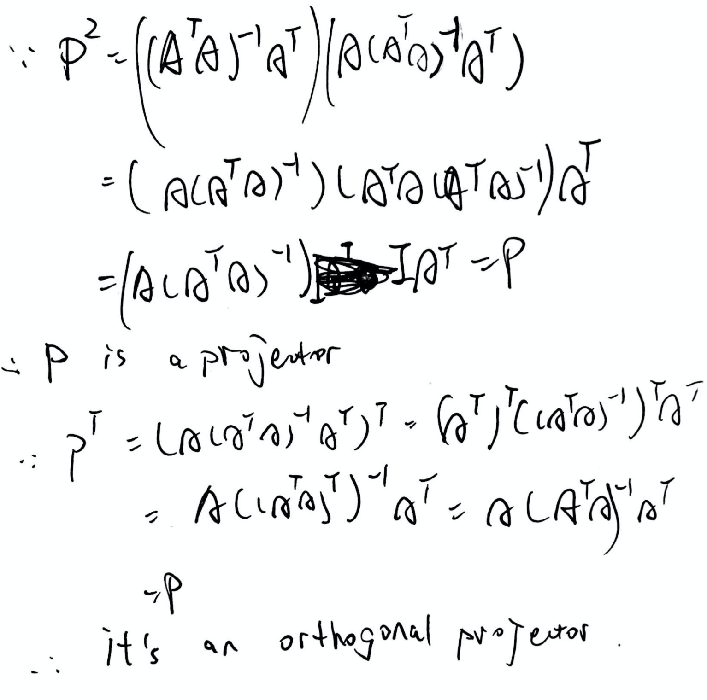
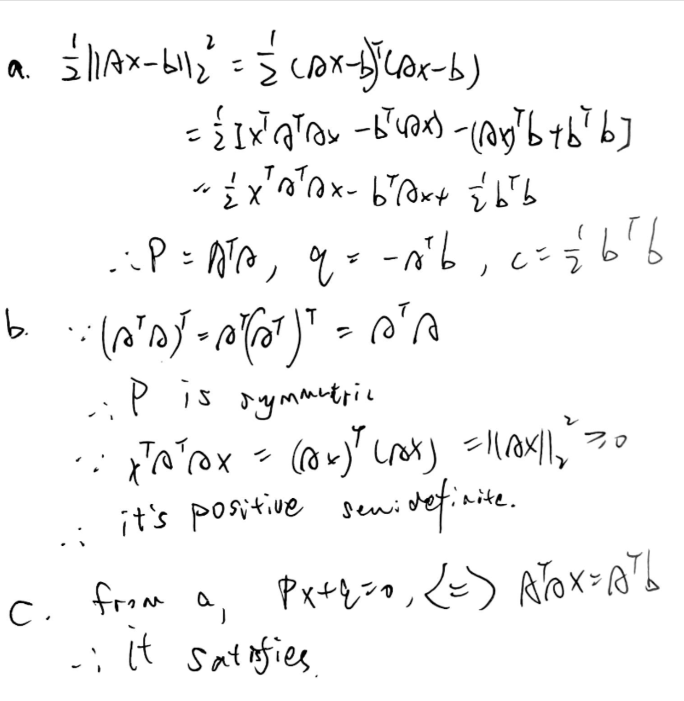
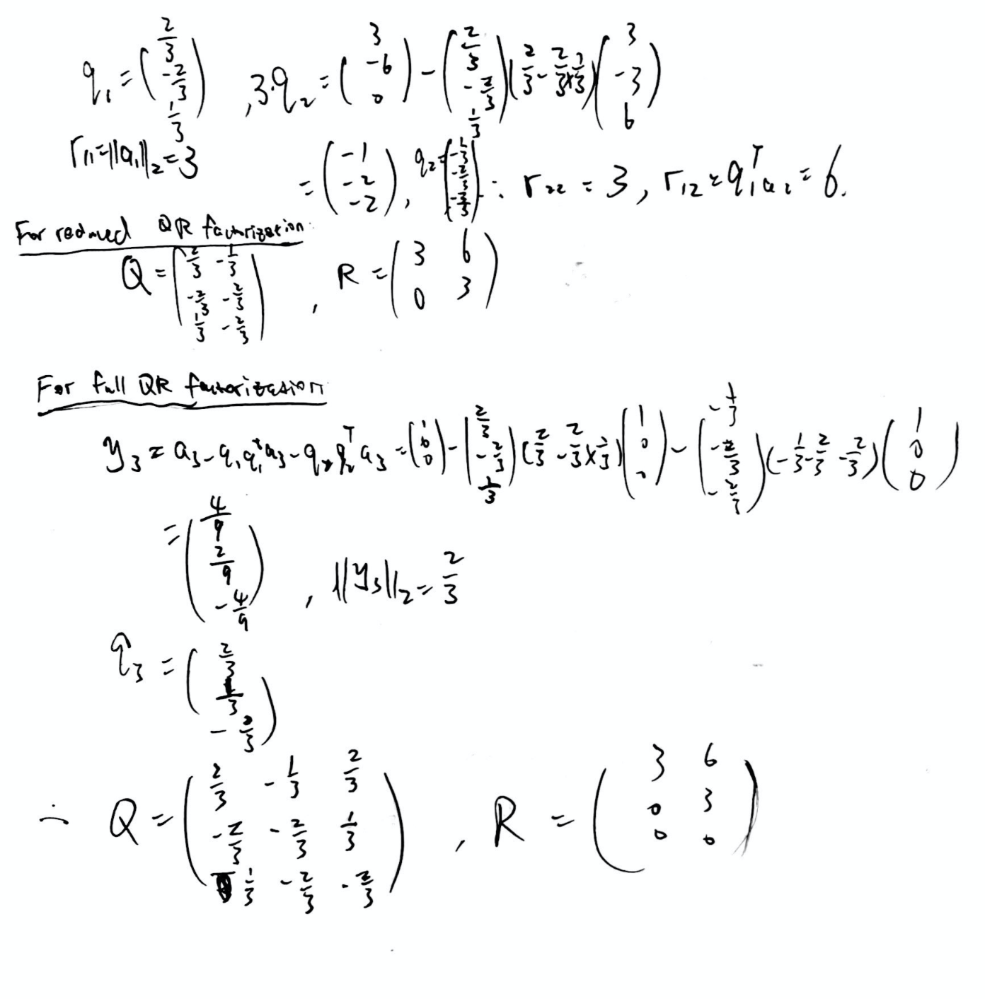

# Math 365 / Comp 365: Homework 6

# Charles Zhang

### *Please post your homework on Moodle

The following line sources functions from the class file `365Functions.r`. Feel free to use any of these functions throughout the semester.
```{r, message=FALSE}
source("https://drive.google.com/uc?export=download&id=10dNH3VbvxS8Z3OHjP4i9gRbtsf91VVBb")
require(Matrix)
```

### Problem 1
A square matrix $P$ is a ***projector*** if $P^2=P$. A projector is an ***orthogonal projector*** if $P^T=P$. Let $A$ be an $m \times n$ matrix with $m \geq n$. Recall from class that we showed that the orthogonal projection of a vector b onto the column space of $A$ is given by 
$$\hat{b}=A A^+ b=A(A^T A)^{-1}A^Tb=Pb, $$
where $A^+$ is the pseudoinverse of $A$. Show that according to the definitions above, the matrix $P=A(A^T A)^{-1}A^T$ is indeed an orthogonal projector.

Hint: the transpose of the inverse of an invertible matrix is the inverse of the transpose of that invertible matrix.



### Problem 2

#### *Note: This is Exercise 2 from the least squares activity*

Consider the points:
```{r}
t=1:8
y=c(1,3,2,5,5,7,7,7)
plot(t,y,col='red',pch=20,cex=2,xlim=c(1,8),ylim=c(0,10))
grid()
```

a) Setup and solve the normal equations in order to find the least squares straight line fit (i.e., polynomial of degree 1) for this data. Plot your regression line on the same plot with the points.

```{r}
V = Vandermonde(t)
A2 = V[,1:(1+1)]

coeffs2 = solve(t(A2)%*%A2, t(A2)%*%y)

f = function(z) Horner(coeffs2,z)
plot(t,y,col='red',pch=20,cex=2,xlim=c(1,8),ylim=c(0,10))
grid()
xx = seq(0,9,length=1000)
lines(xx,f(xx))
```

b) Setup and solve the normal equations in order to find the least squares parabola fit (i.e., polynomial of degree 2) for this data. Plot your best fit curve on the same plot with the points.

```{r}
V = Vandermonde(t)
A3 = V[,1:(2+1)]

coeffs3 = solve(t(A3)%*%A3, t(A3)%*%y)

f = function(z) Horner(coeffs3,z)
plot(t,y,col='red',pch=20,cex=2,xlim=c(1,8),ylim=c(0,10))
grid()
xx = seq(0,9,length=1000)
lines(xx,f(xx))
```

c) Do you expect $||Ax_*-b||_2^2$ (the sum of squared residuals) to be lower for part a) or part b)? Why? Explain in plain English and using linear algebra vocabulary. Does your answer depend on the set of data given to you? Compute the sum of squared residuals for part a) and part b) to see if it matches your intuition.

```{r}
(sum.r1 = (vnorm(A2%*%coeffs2-y))^2)
(sum.r2 = (vnorm(A3%*%coeffs3-y))^2)
```

> The sum of the squared residuals should be lower for part b. In plain English, this is because fitted models in b contains all of the models considered in a. In Linear algebra vocabulary, the columns of A span 2 dimensional plane in $\mathbb{R}^{8}$. In b, the columns of A span 3 dimensional plane in $\mathbb{R}^{8}$ that contains the plane of a. And the answer will not depend on the set oof data. 

### Problem 3

#### *Note: This is Exercise 3 from the least squares activity*

In this exercise, we use optimization to show that a vector $x$ that satisfies the normal equations represents the coefficients of the least squares solution. 

a) Show that the least squares criterion $\frac{1}{2} ||Ax-b||_2^2$ can be written as a quadratic function 
$$ f(x)=\frac{1}{2}x^{\top}Px + q^{\top}x+c.$$
That is, find the matrix $P$, vector $q$ and constant $c$ in terms of $A$ and $b$. Hint: remember that for any vector $v$, $||v||_2^2=v^{\top}v$.

b) Show that the $P$ matrix from part (a) is symmetric and positive semidefinite.

c) Recall that if the $P$ matrix in the quadratic function form above is symmetric positive semidefinite, then $\nabla f(x)=Px+q$, and the critical point $x$ satisfying $\nabla f (x)=0$ is a global minimum. Conclude that the value of $x$ that satisfies the normal equations gives the optimal least squares coefficients.



### Problem 4

#### *Note: Before doing this problem, read Section 4.2.2 in the book.*

The data for a drug concentration model corresponding to Computer Problem 6 in Section 4.2 is here: 
```{r}
hour = (1:10)
concentration = c(6.2,9.5,12.3,13.9,14.6,13.5,13.3,12.7,12.4,11.9)

plot(hour,concentration,pch=19,col='black',
     xlim=c(0,16),ylim=c(0,20),ylab="concentration (ng/ml)",xlab='time (hours)')
grid()
```

You'd like to fit a "surge" model of the form

$$y = c\cdot t \cdot e^{k\cdot t} $$

The problem is that this is not linear.

But logarithms come to the rescue!

$$ \ln(y)  = \ln(c \cdot t \cdot e^{k \cdot t}) =  \ln(c) + \ln(t) + k \cdot t, $$

so

$$ \ln(c) + k\cdot t = \ln(y) - \ln(t) $$

The LHS is linear in $t$.  The RHS is a constant (since both $y$ and $t$ are given).  The unknowns are $\ln(c)$ and $k$.

Use a least-squares fit of a line to this data to get $\ln(c)$ and $k$. Then reassemble the answer into the function $y = c \cdot t \cdot e^{k \cdot t}$ and  plot it along with the data.

Report your values of $c$ and $k$ and give a plot.

```{r}
A = matrix(NA,length(hour),2)
A[,1]=1
A[,2]=hour
b = log(concentration)-log(hour)
coeffs = solve(t(A)%*%A, t(A)%*%b)
(c = exp(coeffs[1]))
(k = coeffs[2])

plot(hour,concentration,pch=19, xlim=c(0,16),ylim=c(0,20))
xx=seq(0,16,length=1000)
exp.mod=function(t){c*t*exp(k*t)}
lines(xx,exp.mod(xx),type="l", col='purple', lwd=2)
points(hour,exp.mod(hour),col='red',pch=19,cex=1)
grid()
```

### Problem 5

#### *Note: This is Exercise 1 from the activity on Gram-Schmidt and QR*

You should do part (a) of this problem ***by hand***.

a) Use the classical Gram-Schmidt orthogonalization algorithm to find the reduced QR factorization and full QR factorization of the matrix 

$$ A = \begin{pmatrix}
2 & 3 \\
-2 & -6 \\
1 & 0
\end{pmatrix}.$$



b) First check your answers by checking that $A=QR$ and $A=\bar{Q}\bar{R}$. Then check if you computed the same factorizations as the `qr` function in R, which you can do with the following code

```{r}
A=cbind(c(2,-2,1),c(3,-6,0))
# Reduced QR
out=qr(A)
(R=qr.R(out))
(Q=qr.Q(out))
Q%*%R
```

Note that R's `qr` algorithm does not ensure that all of the diagonal entries of $R$ are nonnegative (in which case the factorization is not unique). If you want to force the $R$ matrix to have positive diagonals, you can form a diagonal matrix $S$ whose $i^{th}$ diagonal is equal to the sign of the $i^{th}$ diagonal of $R$. Then let $\tilde{Q}=QS$ and $\tilde{R}=SR$, so that $\tilde{Q}\tilde{R}=QS^2 R=QR=A$ (since $S^2=I$).

```{r}
# Fix signs
s=sign(diag(R))
S=diag(s)
Q.tilde=Q%*%S
R.tilde=S%*%R
Q.tilde%*%R.tilde
```

```{r}
# Full QR
(R.bar=qr.R(out,complete=TRUE))
(Q.bar=qr.Q(out,complete=TRUE))
Q.bar%*%R.bar
```

```{r}
Q = rbind(c(2/3,-1/3),c(-2/3,-2/3),c(1/3,-2/3))
R = rbind(c(3,6),c(0,3))
Q%*%R
Q.bar = rbind(c(2/3,-1/3,2/3),c(-2/3,-2/3,1/3),c(1/3,-2/3,-2/3))
R.bar = rbind(c(3,6),c(0,3),c(0,0))
Q.bar %*% R.bar
```


c) Use the reduced QR factorization of $A$ from part (a) to find the least squares solution to 
$$ \begin{pmatrix}
2 & 3 \\
-2 & -6 \\
1 & 0
\end{pmatrix}
\begin{pmatrix}
x_1 \\
x_2
\end{pmatrix}
=
\begin{pmatrix}
3 \\
-3\\
6
\end{pmatrix}
.$$

```{r}
b=c(3,-3,6)
(x.hat=solve(R,t(Q)%*%b))
```

> by $\hat{R} x=\hat{Q}^{T} b$.

d) You can check that $\bar{Q}^{\top}b=\begin{bmatrix} 6 \\ -3 \\ -3 \end{bmatrix}$. Without doing extra computations (i.e., do not actually multiply out $Ax^*-b$), what is the squared error $||Ax^* - b||_2^2$ associated with the least squares solution in part (c)?

```{r}
b.hat=A%*%x.hat
residuals=b-b.hat
(ssr=(vnorm(residuals))^2)
```

e) Recall that if $A$ is an $m\times n$ matrix, the null space of $A^{\top}$ is the orthogonal complement of the column space of $A$ and $\hbox{dim}(\hbox{null}(A^{\top}))+\hbox{dim}(\hbox{col}(A))=m$. Use the full QR factorization of the $A$ matrix above to find a basis for the null space of $A^{\top}$.  
> $q_{3}=\left(\begin{array}{c}\frac{2}{3} \\ \frac{1}{3} \\ -\frac{2}{3}\end{array}\right)$ in part a gives a basis for the null space of $A^{T}$, the orthogonal complement of the column space of A.

### Problem 6

#### *Note: This is Exercise 3 from the activity on Gram-Schmidt and QR*

The vectors $u$ and $v$ below are the x-coordinates and y-coordinates of 50 points $(u_i,v_i)$ in the plane. We want to fit a circle to these points. Denote the center of the circle by $(u_c,v_c)$ and the radius by $R$. A point $(u,v)$ is on the circle if $(u-u_c)^2+(v-v_c)^2=R$. We can therefore formulate the fitting problem as 

$$\min_{u_c,~v_c,~R} \left\{\sum_{i=1}^{50} \left[(u_i-u_c)^2+(v_i-v_c)^2-R^2\right]^2  \right\}.$$

If we do a change of variable $w=u_c^2+v_c^2-R^2$, then we can write the above problem as a linear least squares problem 
$$\min_{x}||Ax-b||^2,$$
where $x=\begin{bmatrix} u_c \\ v_c \\ w \end{bmatrix}$.

```{r}
u = c(-3.9265307,-3.1716160e+00,-1.6115988e+00,-2.6679398e+00,-1.7299714e+00,-2.2185018e+00,-2.0618500e+00,-1.4774499e+00,-3.2095408e+00,-2.0139385e+00,-2.0965393e+00,-2.8414848e+00,-3.5516322e+00,-2.3325005e+00,-1.6889345e+00,-1.4937155e+00,-1.3103945e+00,-1.3082423e+00,-1.5221371e+00,-1.8621796e+00,-2.8784185e+00,-3.3058351e+00,-2.9418136e+00,-3.5689305e+00,-3.2715656e+00,-1.8167830e+00,-2.6160985e+00,-3.6369299e+00,-3.6094960e+00,-3.8213899e+00,-3.5639197e+00,-2.9667150e+00,-1.9473222e+00,-3.0470691e+00,-2.8955875e+00,-3.2029692e+00,-2.2688964e+00,-2.3212990e+00,-1.1585153e+00,-1.8993455e+00,-3.5771792e+00,-2.6473229e+00,-1.4699478e+00,-3.7978927e+00,-2.0968345e+00,-4.0118440e+00,-2.2415905e+00,-1.3737454e+00,-2.0935937e+00,-1.4260492e+00)

v = c(5.7992251e+00,7.3130620e+00,7.5592434e+00,7.6911348e+00,5.5113079e+00,7.7442101e+00,7.7091849e+00,6.0549104e+00,7.5170875e+00,7.6045473e+00,5.1354212e+00,
5.0671844e+00,7.3910732e+00,7.6949226e+00,5.3469286e+00,7.3473664e+00,6.8715471e+00,6.7842012e+00,5.7283630e+00,7.7633148e+00,7.7677261e+00,5.4778857e+00,5.0690285e+00,5.5246190e+00,7.6772318e+00,5.3181407e+00,7.6148680e+00,7.3524730e+00,6.0303455e+00,5.8476992e+00,5.8479253e+00,5.3237261e+00,5.1703804e+00,5.4245981e+00,7.7991795e+00,5.5734007e+00,7.8705366e+00,5.1617927e+00,6.1579013e+00,5.4067639e+00,7.2445803e+00,7.6805233e+00,6.1180277e+00,7.3691475e+00,7.6463880e+00,6.1479510e+00,7.7414349e+00,7.2054473e+00,5.2385698e+00,5.8594283e+00)
```

a) Define $A$ and $b$ in this least squares formulation. What are their dimensions?

> $\min _{u_{c}, v_{c}, w}\left\{\sum_{i=1}^{50}\left[-2 u_{i} u_{c}-2 v_{i} v_{c}+w+u_{i}^{2}+v_{i}^{2}\right]^{2}\right\}=\min _{x}\|A x-b\|^{2}$  <br><br>
the $i^{\text {th }}$ entry of 50x1 vector b is $u_{i}^{2}+v_{i}^{2}$, and the 50x3  matrix $A$ has $2 u$ in the first column, $2 v$ in the second colum, and $-1$ in the third columns.

b) Solve the least squares problem to find $u_c$, $v_c$, and $w$ (you can solve the normal equations or use `qr.solve`), and then use the change of variable equation to find $R$.

```{r}
A=cbind(2*u,2*v,rep(-1,length(u)))
b=u^2+v^2
coeffs=qr.solve(A,b)

(uc=coeffs[1])
(vc=coeffs[2])
(w=coeffs[3])
(R=sqrt(uc^2+vc^2-w))
```

c) To double check your work, let's plot the data and the fitted circle using the following code:

```{r}
# enter your values for uc, vc, and R here
uc=coeffs[1]
vc=coeffs[2]
R=sqrt(uc^2+vc^2-w)
```

```{r}
# plot code
t=seq(0,2*pi,length=1000) # parameterize points on the circle
par(pty="s") # for the plot to be square
plot(R*cos(t)+uc,R*sin(t)+vc,type='l',lty=2,lwd=3,xlim=c(-4.1,-1.1),ylim=c(5,8),xlab="u",ylab="v") # plot the best fit line
points(u,v,pch=19,col="red") # plot the initial data points
points(uc,vc,pch=4) # plot an x at the center point (uc,vc)
```

### Problem 7

#### *Note: This is Part IV from the activity on orthogonal polynomials*

Given some vector $g$ in a vector space ${\cal V}$ and some subspace ${\cal S}$ of the vector space ${\cal V}$, the least squares problem is to find the vector $\hat{g} \in {\cal S}$ that is closest to $g$; that is, 
$$\hat{g} = \mbox{argmin}_{f \in {\cal S}} \left\{||g-f||^2 \right\}.$$

In our previous work, the vector space ${\cal V}$ was $\mathbb{R}^m$ and we called the vector $g$ by $b$; the norm used to measure "closest" was the Euclidean 2-norm; the subspace ${\cal S}$ was the column space of $A$ for some matrix $A$; and we denoted the vector in ${\cal S}$ that is closest to $b$ by $\hat{b}$. 

In our new inner product space of continuous functions, ${\cal V}={\cal C}([a,b])$, ${\cal S}$ is some subspace of functions (often the space of polynomials of a given degree), and the squared error to be minimized is
$$||g-f||^2=\langle g-f, g-f \rangle =\int_a^b [g(x)-f(x)]^2~dx.$$
The rest of the main ideas are exactly the same. The solution is still an orthogonal projection of $g$ onto ${\cal S}$, which you know how to do if you have an orthonormal basis for ${\cal S}$. We found an orthogonal basis in Part I of the activity, which we learned in Part II is made up of elements called the Legendre polynomials.

a) Let $g(x)=x^2+2x-3$ (the same quadratic function we used in Part IIIa of the activity). Find the least squares polynomial approximation of degree 1 (i.e., a line) to the function $g(x)$ on the interval $[-1,1]$. That is, find 
$$ \hat{g}=\mbox{argmin}_{f \in {\cal P}_1} \left\{||g-f||^2 \right\}=\mbox{argmin}_{f \in {\cal P}_1} \left\{\int_{-1}^1 [g(x)-f(x)]^2 \right\}.$$

- Hint 1: The best fit line is NOT simply $2x-3$, the lower order terms of $g(x)$. This is because the basis of monomials are NOT orthonormal!

- Hint 2: You should be able to find the answer without doing any additional computations beyond what you've already done for Part III.

>As the Legendre polynomials are ortthogonal, <br>
$\hat{g}(x)=\left\langle g, q_{0}\right\rangle q_{0}(x)+\left\langle g, q_{1}\right\rangle q_{1}(x)=\frac{-16}{3 \sqrt{2}} \frac{1}{\sqrt{2}}+2 \sqrt{\frac{2}{3}} \sqrt{\frac{3}{2}} x=2 x-\frac{8}{3}$


b) Let $h(x)=\cos\left(\frac{\pi}{2}x^2+\pi x\right)$. Here is a plot of $h(\cdot)$ on the interval $[-1,1]$:
```{r}
x=seq(-1,1,length=1000)
plot(x,cos(pi/2*x^2+pi*x),type='l',lwd=3)
```

Find 
$$ \hat{h}=\mbox{argmin}_{f \in {\cal P}_3} \left\{\int_{-1}^1 [h(x)-f(x)]^2 \right\}, $$
and plot $\hat{h}(\cdot)$ on the same graph as $h(\cdot)$ on the interval $[-1,1]$. How close (using the standard $L^2$ distance on functions) are $h(x)$ and $\hat{h}(x)$? Hint: feel free to use R or Wolfram Alpha to compute integrals.

> As $\hat{h}=\sum_{i=0}^{3}\left\langle h, q_{i}\right\rangle q_{i}$

```{r}
h=function(x){cos(.5*pi*x^2+pi*x)}
q0=function(x){sqrt(1/2)}
q1=function(x){sqrt(1.5)*x}
q2=function(x){(3*x^2-1)*sqrt(5/8)}
q3=function(x){(5*x^3-3*x)*sqrt(7/8)}

int0 <- function(x) {q0(x)*h(x)}
c0=integrate(int0,lower = -1, upper = 1)
c0=c0$value
int1 <- function(x) {q1(x)*h(x)}
c1=integrate(int1,lower = -1, upper = 1)
c1=c1$value
int2 <- function(x) {q2(x)*h(x)}
c2=integrate(int2,lower = -1, upper = 1)
c2=c2$value
int3 <- function(x) {q3(x)*h(x)}
c3=integrate(int3,lower = -1, upper = 1)
c3=c3$value
s
coeffs=c(c0,c1,c2,c3)
m=cbind(c(1/sqrt(2),0,0,0),c(0,sqrt(1.5),0,0),c(-sqrt(5/8),0,3*sqrt(5/8),0),c(0,-3*sqrt(7/8),0,5*sqrt(7/8)))

(coeffs.p = m %*% coeffs )
```

> $\hat{h}(x)=0.722 x^{3}-1.419 x^{2}-0.948 x+0.645$

```{r}
x=seq(-1,1,length=1000)
plot(x,cos(pi/2*x^2+pi*x),type='l',lwd=3,ylab="")
lines(x,0.722*x^3 - 1.419*x^2-0.948*x+0.645,lwd=3,col="red")
```

> The distance is $\|h(x)-\hat{h}(x)\|=\sqrt{\langle h(x)-\hat{h}(x), h(x)-\hat{h}(x)\rangle}$

```{r}
h.hat = function(x){0.722*x^3 - 1.419*x^2-0.948*x+0.645}
p = function(x){(h(x)-h.hat(x))^2}
sqrt(integrate(p,-1,1)$value)
```


