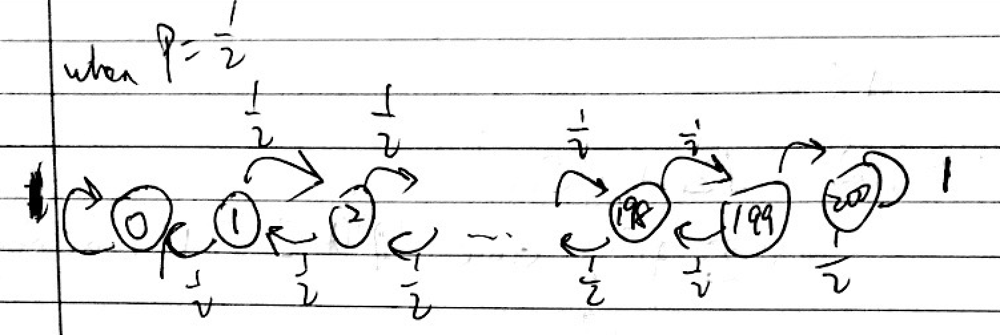
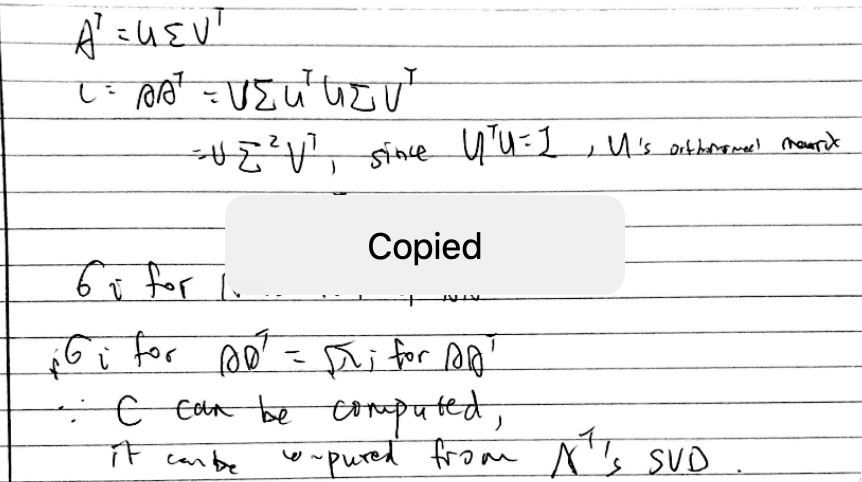

# Math 365 / Comp 365: Homework 7

# Charles Zhang

### *Please submit your assignment on Moodle*

The following line sources functions from the class file `365Functions.r`. Feel free to use any of these functions throughout the semester.
```{r, message=FALSE}
source("https://drive.google.com/uc?export=download&id=10dNH3VbvxS8Z3OHjP4i9gRbtsf91VVBb") #365functions.R
require(Matrix)
require(expm)
require(igraph)
require(foreign)
```


### Problem 1

#### *Note: This is Part II of the activity on Power Iteration

(a) Show that if $A$ is an $n \times n$ invertible matrix and $\lambda$ is an eigenvalue of $A$ with eigenvector $v$, then $\frac{1}{\lambda}$ is an eigenvalue of $A^{-1}$ with the same eigenvector $v$. 

> $\because A v=\lambda v \therefore A^{-1} A v=\lambda A^{-1} v \therefore \frac{1}{\lambda} v=A^{-1} v$

(b) What happens if you apply the power iteration to $A^{-1}$?

> I will converge to the eitenvector where the magnitude of the eigenvalue of A is the smallest.s

(c) Let $A$ be an $n \times n$ matrix, and let $C=A-sI$, where $I$ is the $n \times n$ identity matrix and $s$ is a scalar. Show that if $\lambda$ is an eigenvalue of $A$ with eigenvector $v$, then $\lambda-s$ is an eigenvalue of $C$ with the same eigenvector $v$. Note: $s$ is often called a **shift**.

> $C v=(A-s I) v=A v-s v=\lambda v-s v=(\lambda-s) v$

(d) Let's say you had a guess $\bar{\lambda}$ for an eigenvalue of $A$ and wanted to find the associated eigenvector. Can you use the previous two results to come up with a good way to do that?

> Let $\lambda$ be the shift s from part c, and get the actual eigenvalue by the inverse power iteration. In the end, add this $\lambda$ back the eigenvalue. 

### Problem 2

#### *Note: This is Exercise 2 of the activity on Applications of Eigenvectors/Eigenvalues

Congratulations, you just turned 21! First step: go on kayak.com to find a cheap flight. Second step: go on hotwire.com to find a cheap hotel. Third step: Vegas, baby!

Your plan is to bring \$100 of gambling money, gamble \$1 at a time, and stop gambling when you hit \$0 (then learn how to take joy in your friends' successes) or when you hit \$200 (at which point you'll have no trouble finding different ways to spend your winnings in Vegas). Let's assume at first that the probability of winning each game is 50% (probably not the best assumption).

(a) Let's model your earnings with a Markov chain. What are the states? Draw a state diagram and label the edge with probabilities.



(b) Form the transition matrix $P$. Hint: use my `TriDiag` function from `365Functions.r`. Check that $P$'s rows sum to 1 using the command `rowSums`. 

```{r}
p = 0.5
gamble = 1
target = 200
N = ceiling(target/gamble)+1
d = rep(0,N)
d[1] = d[N]=1
l = rep(1-p,N-1)
u = rep(p,N-1)
u[1] = 0
l[N-1] = 0
P = TriDiag(d,l,u)
rowSums(P)
```

(c) Numerically compute the probability that you have \$105 after placing 10 different \$1 bets. How about \$106?

```{r}
d = dim(P)[1]
x = rep(0,d)
x[101] = 1
P.t = as.matrix(t(P))
p.10 = P.t %^% (10) %*% x
p.10[105]
p.10[106]
```

(d) Use `eigen` to find the eigenvalues and eigenvectors of $P^{\top}$. What do you notice? Can you explain why the eigenvectors associated with the eigenvalue 1 are steady-state distributions?

```{r}
eigen(P.t)
```

> There are two eigenvalues equal to 1, because of the different absorbing states. And the eigen vectors asscociated with these two eigenvalues are 0 vectors, since these vectors correspond to the steady-state distributions.

(e) This Markov chain is not irreducible! Once you reach \$0 or \$200, you cannot reach any other state. We say that those two states are ***absorbing*** states. We are interested in the absorption probabilities; i.e., what is the probability that you reach \$0 before \$200, and vice versa?

To answer this, we can first reorder the state labels so that the absorption states \$0 and \$200 are the first two listed, and then everything else. That is, we can rearrange the transition matrix $P$ into the following form:
$$P=\begin{bmatrix} I & 0 \\ B  & Q\end{bmatrix},$$
where 

- $I$ is a 2x2 identity matrix

- $0$ is a $2 \times (N-2)$ matrix of zeros

- $B$ is a $(N-2) \times 2$ matrix giving the transition probabilities from the non-absorbing states (called the ***transient*** states) to the absorbing states, and

- $Q$ is the matrix of transition probabilities from the transient states to other transient states.

To compute $B$ and $Q$ in `R`, you can either directly access the appropriate submatrices of the original transition matrix $P$ or you can rearrange $P$ into the form above.
Here is an example of how to rearrange a matrix in R:
```{r}
(Z=matrix(1:16,nrow=4,ncol=4))
new.order=c(1,4,2,3)
(Z.rearranged=Z[new.order,new.order])
```

Once you have $B$ and $Q$, to find the absorption probabilities, compute the ***fundamental matrix*** $S=(I-Q)^{-1}$ (where this $I$ is the same size as $Q$), and the probabiity of absorbing into state $j$ (say \$0 in this case) starting from transient state $i$ (say \$100 in this case) is $(SB)_{ij}$. If you start with \$100, what is the probability of reaching \$200 before going broke? How does it change if you start with \$120 and only aim to make \$80 profit?

Aside: we won't go into details about why $SB$ is the solution to the absorption probabilities. For that, you'll need to take some probability!

```{r}
Q=P[2:(N-1),2:(N-1)]
B=P[2:(N-1),c(1,N)]

S=solve(diag(N-2)-Q)
rowSums(S%*%B)

(abs.prob=S%*%B)
abs.prob[100,]
abs.prob[120,]
```

> When I get $100 to bet, the the probability to $200 before $0 is 50% while 60% if get $120 to start.

(f) Does your probability of reaching \$200 before going broke change if you bet \$10 at a time or \$100 at a time, starting at \$100 of gambling money?

```{r}
p = 0.5
gamble = 10
target = 200
N = ceiling(target/gamble)+1
d = rep(0,N)
d[1] = d[N]=1
l = rep(1-p,N-1)
u = rep(p,N-1)
u[1] = 0
l[N-1] = 0
P = TriDiag(d,l,u)

N = dim(P)[1]
Q = P[2:(N-1),2:(N-1)]
B = P[2:(N-1),c(1,N)]
S = solve(diag(N-2)-Q)
abs.prob = S%*%B
abs.prob[10,]


p = 0.5
gamble = 100
target = 200
N = ceiling(target/gamble)+1
d = rep(0,N)
d[1] = d[N]=1
l = rep(1-p,N-1)
u = rep(p,N-1)
u[1] = 0
l[N-1] = 0

P = TriDiag(d,l,u)
N = dim(P)[1]
Q = P[2:(N-1),2:(N-1)]
B = P[2:(N-1),c(1,N)]
S = solve(diag(N-2)-Q)
(abs.prob = S%*%B)
```

> It does not change: it is still 50%.

(g) The actual odds of winning a game in Vegas are not equal to 50%! Let's say you are betting on red at the roulette wheel. Assuming it is a wheel with a double zero, your chances of winning each game are $18/38 \approx 47.4$%. Now does your  probability of reaching \$200 before going broke change if you bet \$1 at a time, \$10 at a time, or \$100 at a time, starting with \$100 of gambling money? What is the best strategy?

Note 1 : the model in this problem does not take into account any utility you might derive from the free beverages provided by the casino for the duration of your gambling activities.

Note 2: [Here](http://www.onlineroulette.ca/guides/american-vs-european-roulette.php) is some more information about single zero versus double zero roulette wheels. 

```{r}
p = 18/38
gamble = 1
target = 200
N = ceiling(target/gamble)+1
d = rep(0,N)
d[1] = d[N]=1
l = rep(1-p,N-1)
u = rep(p,N-1)
u[1] = 0
l[N-1] = 0

P = TriDiag(d,l,u)
N = dim(P)[1]
Q = P[2:(N-1),2:(N-1)]
B = P[2:(N-1),c(1,N)]
S = solve(diag(N-2)-Q)
abs.prob = S%*%B
abs.prob[100,]

p = 18/38
gamble = 10
target = 200
N = ceiling(target/gamble)+1
d = rep(0,N)
d[1] = d[N]=1
l = rep(1-p,N-1)
u = rep(p,N-1)
u[1] = 0
l[N-1] = 0

P = TriDiag(d,l,u)
N = dim(P)[1]
Q = P[2:(N-1),2:(N-1)]
B = P[2:(N-1),c(1,N)]
S = solve(diag(N-2)-Q)
abs.prob = S%*%B
abs.prob[10,]


p = 18/38
gamble = 100
target = 200
N = ceiling(target/gamble)+1
d = rep(0,N)
d[1] = d[N]=1
l = rep(1-p,N-1)
u = rep(p,N-1)
u[1] = 0
l[N-1] = 0

P = TriDiag(d,l,u)
N = dim(P)[1]
Q = P[2:(N-1),2:(N-1)]
B = P[2:(N-1),c(1,N)]
S = solve(diag(N-2)-Q)
(abs.prob = S%*%B)
```

> If we bet $1, we get 99.997% chance to get 0 in the end, 0.74% to bet $10, and 0.526 to bet $100. Therefore, we should bet all $100.

### Problem 3

#### *Note: This is Exercise 3 of the activity on Applications of Eigenvectors/Eigenvalues

Russian historians often attribute the dominance and rise to power of Moscow to its strategic position on medieval trade routes (see below).  Others argue that sociological and political factors aided Moscow's rise to power, and thus Moscow did not rise to power strictly because of its strategic location on the trade routes.  You are to use eigenvectors to analyze this question.


The following code loads the name of the Russian cities (in `RusCity`), loads the adjacency matrix into the matrix `A`, and plots the graph.
```{r, message=FALSE}
# this package is required to plot the graph
require(igraph)
```
```{r}
# This loads the adjacency matrix into A and plots it
source("https://drive.google.com/uc?export=download&id=12exaJ8eOwe-BVKYAPOD0RH25HrOP0Rjx")
```

(a) Let $B=A+I$ be the ***augmented adjacency matrix***, let $x=(1,1,\ldots,1)^{\top}$, and compute $Bx$, $B^2x$, $B^3x$. The entries are nonnegative integers, and they can be interpreted as counting something. What does the $i^{th}$ entry $(B^k x)_i$ count?

> The $ij^{th}$ entry of the matrix $B^k$ is the number of paths of length k (or less from i to vertex j). Then the $i^{th}$ entry $(B^{k} x)i$ is the number of all possible paths with less than or equal to k walk distance from the i-th entry to other cities.

(b) The sequence $Bx$, $B^2x$, $B^3x$, ... should converge to the dominant eigenvector of $B$. Explain why the dominant eigenvector of the augmented adjacency matrix is a measure of accessibility. If this is not clear, you should have a look at the article ["Linear Algebra in Geography: Eigenvectors of Networks,"](http://www.jstor.org/stable/2689388?seq=1#page_scan_tab_contents) by Philip D. Straffin, Jr. in Mathematics Magazine, November 1980.

> When k increases, if a entry of the dominant vector is large, it is more accessible; Otherwise, it is less accessible.

(c) Is the augmented adjacency matrix $B$ primitive? How do you know?

> Itt is primitive since it is possible to travel from a city to another city. Also, it is aperiodic.

(d) Compute the dominant eigenvector of $B$.  Do it two ways: (i) use `R`'s function `eigen`; (ii) use my power iteration function `PI`.  Report the number of steps needed in power iteration so that the answer you get is correct to 2 decimal places in the 2-norm.

```{r}
B = A + diag(nrow(A))
(out = PI(B,k=100,tol=0.5e-2))
```

> It takes 13 steps.

e) ***Gould's index of accessibility*** is just the dominant eigenvector of $B$, normalized so that the entries sum to 1; i.e., if $v$ is the dominant eigenvector, then Gould's index is
```
v/sum(v)
```

Compute Gould's index for this problem and answer the historians' question.

```{r}
eigen.v = eigen(B)$vectors
v = eigen.v[,1]
idx = v/sum(v)
idx
39-rank(idx)[35]
```

> Moscow is ranked around fifth in the Gould ranking, but its accessibility is not the best, so maybe other factors involved.  

### Problem 4

#### *Note: This is Exercise 4 from the activity on the SVD. Make sure that you have worked through Exercise 3 from this activity to understand how to do least squares with the SVD.*

Use the SVD to find a least squares solution to $Ax= b$, where $b = (15, 12,  8, 5,  7)^T$ and  $A=\begin{pmatrix}1 & -1 & 2\\1 & 1& 4\\0& 0& 4\\1& 1& 2\\1& 1& 1\end{pmatrix}$.

(a) First do it with the reduced SVD (this is what `R` will give back if you use `svd(A)`).  You should find $x^*$, $\hat{b}$, and the residual vector $r=b-\hat{b}$.  Compute $||r||$.

```{r}
A = cbind(c(1,1,0,1,1),c(-1,1,0,1,1),c(2,4,4,2,1))
b = c(15,12,8,5,7)
svd = svd(A)
d = svd$d
V = svd$v
U = svd$u
cc = t(U) %*% b
y = cc/d
(x = V %*% y)
(bhat = A %*% x)
sqrt(sum((b-bhat)^2))
```

> It's 2.943007.

(b) Now use the full SVD to do it (you do this by telling `svd` how many vectors you want in `U` by using `nu = ???`).  When you do it this way you have to be careful about dividing by zero if $A$ is not full rank, but the upside is that you can calculate $||r||$ using the vector $c=\bar{U}^T b$, without having to compute $x^*$ or $r$.  

Note: in practice, you would always compute the least squares solution with the reduced SVD, not the full one.

```{r}
svd = svd(A,nu=5)
U.bar = svd$u
cc = t(U.bar) %*% b
cc
sqrt(sum(cc[4:5]^2))
```

### Problem 5

#### Note: This is Exercise 2 from the activity on Applications of the SVD 

```{r,message=FALSE}
library(jpeg)
```

You might be feeling a bit crabby about our current situation, so we are going to do analysis on the crabby.jpg image. Make sure to dowload and save this in the same folder as your markdown file (I've saved mine within a folder called Images).
```{r}
ColorImg = readJPEG("crabby.jpg")
dim(ColorImg)
```

`ColorImg` is a $318 \times 480 \times 3$ data cube. Think about what each entry is recording. Looking at a few images may give you a hint (Carefully look over the code below). The `imPlot` function can plot an image: 
```{r fig.width=6, fig.height=6}

imPlot = function(img,...) {
  plot(1:2, type='n',xlab=" ",ylab= " ",...)
  rasterImage(img, 1.0, 1.0, 2.0, 2.0)
}

imPlot(ColorImg,main="Crabby")

Red=ColorImg
Red[,,2]=Red[,,3]=0
imPlot(Red,main="Red Crabby")
Green=ColorImg
Green[,,1]=Green[,,3]=0
imPlot(Green,main="Green Crabby")
Blue=ColorImg
Blue[,,1]=Blue[,,2]=0
imPlot(Blue,main="Blue Crabby")
```

Each of the three sheets corresponds to the amount of red, green, and blue values within an image! Let's convert this color image to a grayscale image (How would below change if we were instead to do the analysis on the color image?). Think what the following is doing:

```{r}
img=0.2989*ColorImg[,,1]+0.5870*ColorImg[,,2]+0.1140*ColorImg[,,3]
imPlot(img,main="Crabby")
```

To store the image, we need to store 152,640 floating point numbers. Our objective in this section is to compress this image using the SVD.

(a) Write a function `approxImg` that uses your `SVDApprox` function to do the following:

- Takes an image and a rank $k$ as the two inputs

- Computes the best rank $k$ approximation to the image

- Thresholds the approximation by setting all values below zero back to zero and all values above one back to one

- Plots the approximate image

```{r}
SVDApprox = function(A,k = floor(1/2*min(nrow(A),ncol(A)))) {
  svd = svd(A)
  d = svd$d
  U = svd$u
  V = svd$v
  if(k==1)
    D=matrix(d[1],nrow=1,ncol=1)
  else
    D=diag(d[1:k])
  M=U[,1:k]%*%D%*%t(V[,1:k])
  return(M)
}

approxImg = function(img,k){
  appImg = SVDApprox(img,k)
  appImg[appImg<0] = 0
  appImg[appImg>1] = 1
  plot(1:2, type='n')
  rasterImage(appImg, 1.0, 1.0, 2.0, 2.0)
  return(appImg)
}
```

(b) Test your `approxImg` function on the grayscale crabby image with $k=5,10,25,50,100$.

```{r}
for (k in c(5, 10, 25, 50, 100)){ 
  print(k)
  newImg = approxImg(img, k) 
}
```

(c) For each approximation level $k$, how many floating point numbers do you need to store? For each $k$, compute the compression ratio, which is the number of floating point numbers needed to store the approximate image divided by the number of floating point numbers needed to store the original image .

```{r}
m=318
n=480
k=c(5,10,25,50,100)
(r=(m+n+1)*k/(m*n))
```

(d) Recall that the optimal approximation error by a rank $k$ matrix (with the error measured by the Frobenius norm) is  $||E_k||_F=||A-A_k||_F=\sqrt{\sum_{i={k+1}}^r \sigma_i^2}$. We can use this to define the *relative error* as 
$$
\left( \frac{\sum_{i={k+1}}^r \sigma_i^2}{\sum_{i={1}}^r \sigma_i^2} \right)^{\frac{1}{2}}.
$$
Note that a higher proportion of energy in the first $k$ singular values leads to a lower relative error. Therefore, matrices $A$ that have a faster decay in the singular values will be easier to approximate by lower rank matrices. 
Plot the singular values of the grayscale crabby image. Then compute the relative error for $k=5,10,25,50,100$.

```{r}
plot(svd(img)$d)

d = svd(img)$d
len.d = length(d)
(error5=sqrt(sum(d[6:len.d]^2)/sum(d^2)))
(error10=sqrt(sum(d[11:len.d]^2)/sum(d^2)))
(error25=sqrt(sum(d[26:len.d]^2)/sum(d^2)))
(error50=sqrt(sum(d[51:len.d]^2)/sum(d^2)))
(error100=sqrt(sum(d[101:len.d]^2)/sum(d^2)))
```

(e) One method to decide on the approximation rank is to choose $k$ such that the relative error is below a given threshold (say 31.6%, which corresponds to having 90% of the energy of all $r$ singular values in the first $k$ singular values). For the grayscale crabby image, let's choose the threshold to be 99.5% of energy, so find $k^*$ such that $\sum_{i={1}}^{k^*} \sigma_i^2 \geq 0.995^2*\sum_{i={1}}^r \sigma_i^2$, and plot the best approximation of the image with rank $k^*$. Compute the relative error for $k^*$.

```{r}
eg= cumsum(d^2)/sum(d^2)
more = (eg>.995^2)
(k.star=which.max(more))
(error = sqrt(sum(d[(k.star+1):len.d]^2)/sum(d^2)))
```

### Problem 6

#### Note: This is Exercise 3 from the activity on the SVD

The SVD can be used to take a two-dimensional or three-dimensional snapshot of high-dimensional data, so that dimensionally-challenged human beings can see it. In this problem, you will use the top two singular values to project some data down to 2-dimensional space where you can see it.

Here is a data set on cereals:
```{r,message=FALSE}
require(foreign)
```
```{r}
cereal = read.dta("http://statistics.ats.ucla.edu/stat/data/cerealnut.dta")
A =  as.matrix(cereal[,2:9])
print(A)
```

To perform this projection, we work with the covariance matrix $C$ of $A$. Compute this as follows:

- For each column of $A$ subtract off the mean of that column. Then each entry is the difference from the mean of that feature

- Now compute the matrix $C = A A^T$.  This is the covariance matrix. It measures how well each of the subjects are correlated. The ij-entry is the dot product of cereal i's data with cereal j's data, so it is (roughly) the cosine of the angle between them 

a) Plot the singular values of the matrix $C$. You should see that there are 2 singular values that stand out from the rest.
```{r}
for (i in 1:ncol(A)) A[,i] = A[,i] - mean(A[,i])
C = A %*% t(A)
xx = svd(C)
plot(xx$d)
```

b) Use the vectors $x = v_1$ and $y = v_2$ from the SVD as the $x$ and $y$ coordinates of points in the plane. Plot these points.  Label the $i^{th}$ point with the $i^{th}$ brand of cereal. To do this, you can use the following command after your plotting command:
```
text(x1, y1, label = cereal$brand)
```

```{r}
V = xx$v 
x1 = V[, 1]
y1 = V[, 2]
plot(x1, y1,pch=20)
text(x1, y1, label = cereal$brand)
```

c) This method should group like cereals next to one another in the plane. Discuss whether you think this is happening.

> The similar cereals are close to each other since the matrix is compressed into the 2-D plane.

d) Note: You could also have used the SVD of $A^{\top}$ instead of the SVD of $C$. Why is this? Provide a quick proof.




